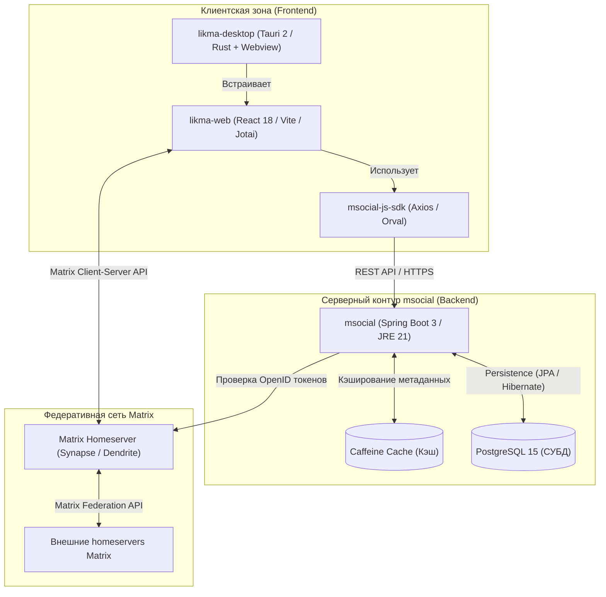
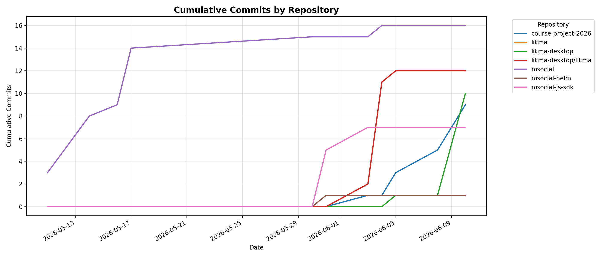
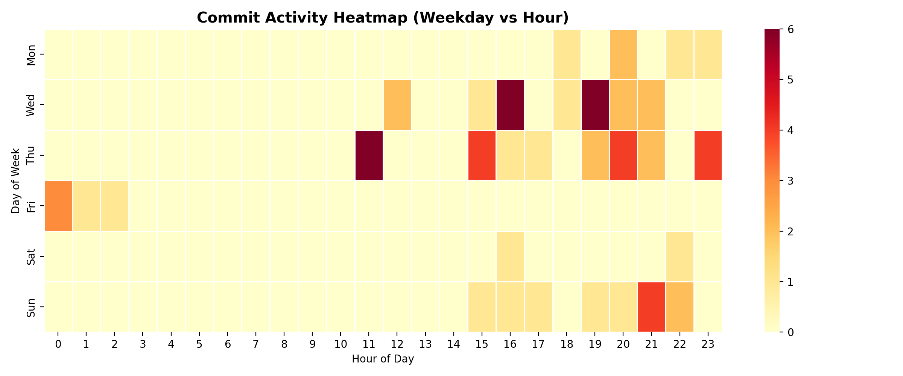

# Likma & msocial Федеративная децентрализованная экосистема социальной сети на базе протокола Matrix

<p align="center">
  
  
  
  
  
  
  
</p>

**Автор:** Иванов Дмитрий Романович  
**Группа:** ПИЖ-б-о-23-2  
**Траектория:** Enterprise  
**Период разработки:** 11.05.2026 – 30.05.2026

---

## Суть и философия проекта

**msocial & likma** — это полноценная федеративная экосистема, превращающая защищенный децентрализованный мессенджер на базе открытого протокола **Matrix** в полнофункциональную социальную сеть.

В отличие от традиционных коммерческих платформ (Telegram, VK, Discord), которые централизуют персональные данные на серверах одной компании, что влечет за собой риски цензуры, утечек информации и единой точки отказа (SPOF), данный проект предлагает архитектуру, основанную на следующих принципах:

1. **Децентрализация и федерация**: Пользователи регистрируются на независимых домашних серверах Matrix (homeservers). Сообщения, комнаты и общие данные синхронизируются между ними с помощью криптографического протокола федерации.
2. **Беспарольная федеративная аутентификация**: Полный отказ от создания локальных паролей на сторонних ресурсах. Клиент авторизуется на своем домашнем сервере Matrix, запрашивает временный OpenID-токен и обменивает его на бэкенде `msocial` на JWT-токен авторизации (с ротацией access/refresh токенов).
3. **Расширенные социальные функции**: Базовые возможности мгновенного обмена сообщениями Matrix расширяются за счет интеграции публичных профилей (с персональными данными и аудиоплеером), ленты публикаций (постов с вложенными медиафайлами), древовидной (Reddit-like) структуры комментариев и тематических сообществ.

---

## Архитектура системы

Взаимодействие компонентов экосистемы основано на REST API бэкенда `msocial`, специфицированного в соответствии со стандартом **OpenAPI 3.1**.

### Схема взаимодействия компонентов



## Структура репозитория (Субмодули)

Проект организован в виде монорепозитория, включающего следующие основные компоненты:

*   [`msocial/`](msocial/) — Серверная часть (бэкенд) на **Java 21 / Spring Boot 3.2**. Обеспечивает работу REST API, интеграцию с Matrix OpenID, кэширование с помощью Caffeine, защиту от спама (Rate Limiting) через Bucket4j и миграции базы данных через Flyway.
*   [`likma/`](likma/) — Клиентское веб-приложение на **React 18 / Vite / TypeScript**. Объединяет функции чатов Matrix и социальную ленту msocial с использованием стейт-менеджера **Jotai** и гибкой дизайн-системы *folds*.
*   [`likma-desktop/`](likma-desktop/) — Десктопное приложение на **Tauri 2 (Rust + WebView)**, собирающее веб-клиент `likma` в нативные приложения под macOS, Linux и Android.
*   [`msocial-js-sdk/`](msocial-js-sdk/) — Автогенерируемый клиентский SDK для интеграции с API `msocial`. Сгенерирован с помощью инструмента `orval` на базе OpenAPI спецификации бэкенда, включает типизированные интерфейсы, axios-клиент и встроенные перехватчики (interceptors) для прозрачной ротации JWT-токенов.
*   [`msocial-helm/`](msocial-helm/) — Конфигурационные файлы **Helm 3** для масштабируемого развертывания бэкенда и базы данных PostgreSQL (в качестве subchart) в кластере **Kubernetes**.

## Навигация по документации

Все проектные артефакты и этапы проектирования подробно задокументированы в директории [`docs/`](docs/):

| Раздел / Директория                                   | Содержимое документации                                      |
| :---------------------------------------------------- | :----------------------------------------------------------- |
| [**`00-project-charter/`**](docs/00-project-charter/) | Паспорт проекта, декомпозиция бизнес-процессов IDEF0, прецеденты BUC, SWOT-анализ и оценка ROI. |
| [**`01-requirements/`**](docs/01-requirements/)       | Подробное описание Use Case сценариев (RUP), глоссарий и доменная модель бизнес-правил. |
| [**`02-architecture/`**](docs/02-architecture/)       | Архитектурный стиль, выбор паттерна PCMEF, ADR-решения и структура Ports & Adapters. |
| [**`03-database/`**](docs/03-database/)               | Физическая и логическая ER-диаграмма бд, DDL скрипты инициализации таблиц и индексов. |
| [**`04-detailed-design/`**](docs/04-detailed-design/) | Диаграммы последовательности (Sequence) по ключевым прецедентам, спецификация API и классов. |
| [**`05-implementation/`**](docs/05-implementation/)   | Описание реализации кодовой базы по слоям, структура пакетов. |
| [**`06-testing/`**](docs/06-testing/)                 | Стратегия тестирования, ручные тест-кейсы, отчет покрытия JaCoCo и метрики нагрузочного теста k6. |
| [**`07-refactoring/`**](docs/07-refactoring/)         | Анализ архитектурного долга, рефакторинг "запахов кода", паттерны Data Mapper и Identity Map. |
| [**`08-ui/`**](docs/08-ui/)                           | Скриншоты интерфейсов веб-приложения Likma (профиль, лента постов, чаты, настройки). |
| [**`09-api/`**](docs/09-api/)                         | Контракт REST API в формате OpenAPI 3.1.                     |
| [**`10-deployment/`**](docs/10-deployment/)           | Руководство по развертыванию (Docker, Compose, Kubernetes, Helm) и администрированию системы. |
| [**`11-user-guide/`**](docs/11-user-guide/)           | Полное пользовательское руководство по функционалу экосистемы. |
| [**`12-final-report/`**](docs/12-final-report/)       | Итоговая пояснительная записка (отчет по курсовой работе): [исходный код Typst](docs/12-final-report/report.typ), [готовый PDF](docs/12-final-report/report.pdf). |

---

### Архитектурный паттерн бэкенда: PCMEF + Hexagonal Architecture

Бэкенд спроектирован с разделением на слои на основе шаблона **PCMEF** (Presentation-Control-Mediator-Entity-Foundation) и принципов гексагональной архитектуры (**Ports & Adapters**) для полной изоляции ядра бизнес-логики:

*   **Presentation (P)**: Слой представления — DTO (`UserDTO`, `PostDTO`, `CommentDTO`), валидаторы, мапперы и конфигурация Scalar/Swagger.
*   **Control (C)**: Слой управления — REST-контроллеры, которые принимают запросы, валидируют входящие данные и вызывают порты бизнес-логики.
*   **Mediator (M)**: Ядро системы (Domain Services) — реализует Use Cases (регистрация, публикация, модерация, ротация токенов) и управляет распределенными транзакциями.
*   **Entity (E)**: Доменные сущности (`User`, `Post`, `Comment`, `Session`) — инкапсулируют бизнес-правила и маппинг БД.
*   **Foundation (F)**: Инфраструктурные адаптеры — реализация Spring Data JPA репозиториев, интеграция с внешними Matrix API для валидации OpenID и локальное кэширование (Caffeine).

## Технологический стек

| Компонент / Слой | Технологии |
| :--- | :--- |
| **Backend Core** | Java 21, Spring Boot 3.2.x, Spring Security, Gradle |
| **База данных** | PostgreSQL 15, миграции Flyway |
| **Кэширование & Лимиты** | Caffeine Cache, Bucket4j (Token Bucket для защиты API от DDoS) |
| **Аутентификация** | Matrix OpenID, JWT (jjwt) с ротацией Access/Refresh токенов |
| **API спецификация** | REST API, OpenAPI 3.1 (Scalar UI / Swagger) |
| **Frontend Core** | React 18, Vite, TypeScript, Jotai, TailwindCSS |
| **Десктопная сборка** | Tauri 2 (Rust, WebView2 / WebKit) |
| **Контейнеризация** | Docker (оптимизированные Multi-stage сборки на базе Alpine JRE) |
| **Оркестрация** | Kubernetes (K8s), Helm 3 |
| **Тестирование** | JUnit 5, Mockito, AssertJ, Testcontainers (БД в Docker), k6 (нагрузочные тесты) |

---

## Установка и запуск

### 1. Подготовка репозитория
Клонируйте репозиторий вместе со всеми зависимыми субмодулями:
```bash
git clone --recurse-submodules https://github.com/lghdnov/CourseProject-2026.git
cd CourseProject-2026
```

### 2. Запуск в среде разработки (Development)

#### Шаг А: Запуск базы данных (PostgreSQL) в Docker
```bash
docker run -d --name msocial-postgres \
  -e POSTGRES_DB=msocial \
  -e POSTGRES_USER=postgres \
  -e POSTGRES_PASSWORD=postgres \
  -p 5432:5432 \
  postgres:15-alpine
```

#### Шаг Б: Запуск бэкенда `msocial`
```bash
cd msocial
./gradlew bootRun
```
Сервер бэкенда запустится на `http://localhost:8080`.  
Интерактивная документация REST API (Scalar UI): `http://localhost:8080/scalar`.

#### Шаг В: Запуск фронтенда `likma`
```bash
cd ../likma
npm install
npm run dev
```
Фронтенд будет доступен по адресу `http://localhost:5173`. Для настройки подключения к msocial перейдите в *Settings -> Matrix Social* внутри интерфейса и укажите `http://localhost:8080`.

---

### 3. Развертывание в Docker
```bash
cd msocial
./gradlew bootJar
docker build -t glitchcat/msocial:latest .
docker run -d -p 8080:8080 \
  -e SPRING_PROFILES_ACTIVE=prod \
  -e SPRING_DATASOURCE_URL=jdbc:postgresql://your-db-host:5432/msocial \
  -e SPRING_DATASOURCE_USERNAME=db_user \
  -e SPRING_DATASOURCE_PASSWORD=db_password \
  -e APP_JWT_SECRET=your_super_secret_signing_key_at_least_256_bits \
  glitchcat/msocial:latest
```

---

### 4. Оркестрация в Kubernetes (Helm)
Сборка и развертывание в K8s с автоматическим поднятием реплицируемой БД PostgreSQL:
```bash
# Обновление зависимостей чартов
helm dependency update ./msocial-helm

# Установка релиза
helm install msocial ./msocial-helm \
  --set postgresql.enabled=true \
  --set postgresql.auth.password=SuperSecretPassword123 \
  --set app.jwt.secret=MyVeryStrongJWTSecretKeyForProd
```

---

### 5. Интеграция сгенерированного SDK
Для взаимодействия с REST API бэкенда в сторонних JS/TS приложениях:
```bash
npm install msocial-js-sdk axios
```
Пример вызова:
```typescript
import { createMsocialClient } from 'msocial-js-sdk';

const client = createMsocialClient('http://localhost:8080');

// Аутентификация через Matrix OpenID токен
const authResponse = await client.auth.login({ openidToken: 'matrix-openid-token-here' });
client.setAuthToken(authResponse.data.accessToken);

// Запрос профиля пользователя
const profile = await client.users.getProfile();
console.log(`Привет, ${profile.data.displayName}!`);
```

---

## Метрики и статистика разработки

### Статистика коммитов

| Параметр | Значение |
| :--- | :--- |
| **Всего коммитов** | 55 |
| **Период активных коммитов** | 11.05.2026 – 30.05.2026 |
| **Средняя интенсивность** | ~5 коммитов/неделю |

### Динамика коммитов по репозиториям


### Тепловая карта активности (Weekday / Hour)


