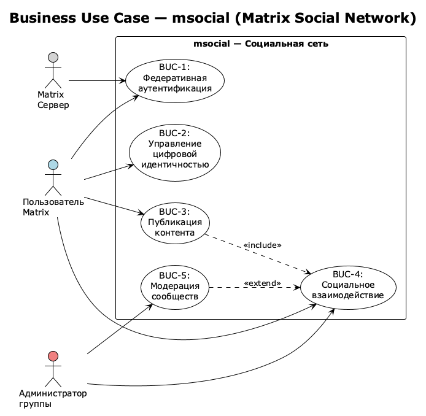
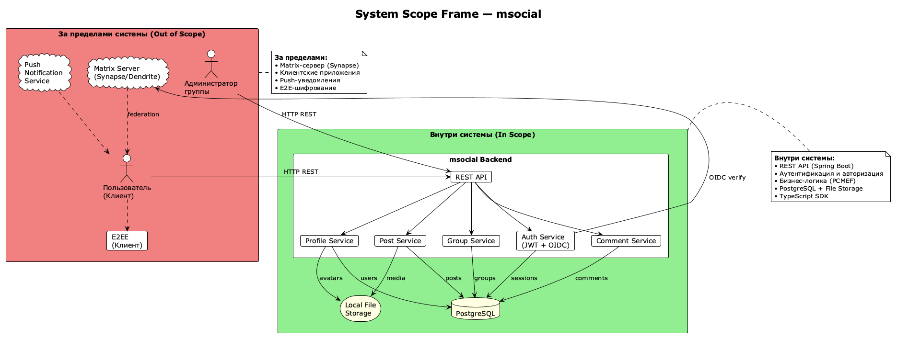
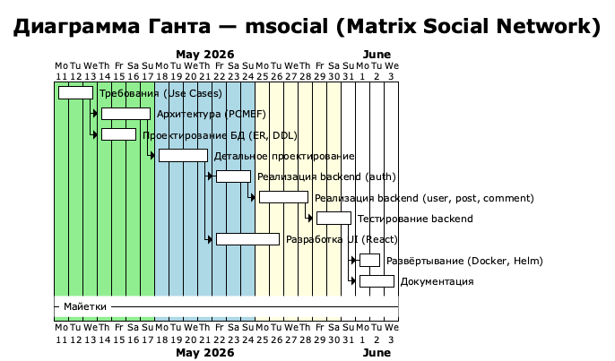

# Паспорт проекта (Project Charter)

## 1. Общие сведения

| Параметр | Значение |
|----------|----------|
| **Название проекта** | msocial - Matrix Social Network |
| **Заказчик** | Учебный департамент, СКФУ |
| **Исполнитель** | Иванов Дмитрий Романович, группа ПИЖ-б-о-23-2 |
| **Траектория** | Web / Enterprise |
| **Сроки** | 11.05.2026 - 30.05.2026 |
| **Бюджет** | 0 ₽ (учебный проект) |
| **Статус** | В разработке (MVP) |

## 2. Описание проекта

**msocial** - это backend-система управления профилем пользователя и групповыми чатами для мессенджера на базе протокола Matrix. Система предоставляет API для управления профилем (аватар, персональные данные, публикации), групповыми чатами (алиасы, управление участниками) и сообществами.

**Цель проекта:** создать масштабируемый и безопасный backend социальной сети с аутентификацией через Matrix OpenID, поддержкой микросервисной архитектуры в будущем и развёртыванием в Kubernetes.

## 3. IDEF0 (функциональная модель)

```
┌─────────────────────────────────────────────────────────────┐
│                      Управление профилем                    │
│                      и групповыми чатами                    │
│                                                             │
│  ┌──────────────┐  ┌──────────────┐  ┌──────────────┐      │
│  │  Управление  │  │  Управление  │  │ Управление   │      │
│  │   профилем   │  │  публикациями│  │  группами    │      │
│  └──────────────┘  └──────────────┘  └──────────────┘      │
└─────────────────────────────────────────────────────────────┘
```

### 3.1. Контекстная диаграмма (A-0)

| Элемент | Содержимое |
|---------|-----------|
| **Функция** | Управление профилем пользователя и групповыми чатами |
| **Входы** | OpenID-токен, данные профиля, медиафайлы, текст постов/комментариев |
| **Выходы** | JWT-токены, профили пользователей, публикации, комментарии, группы |
| **Управление** | Политики безопасности Matrix, правила модерации контента, законодательство о ПДн |
| **Механизмы** | Spring Boot, PostgreSQL, Kubernetes, Docker, GitHub Actions |

### 3.2. Декомпозиция (A0)

| ID | Функция | Описание |
|----|---------|----------|
| A1 | Аутентификация | Вход через Matrix OpenID, генерация JWT, управление сессиями |
| A2 | Управление профилем | Редактирование личных данных, аватаров, статуса |
| A3 | Управление публикациями | Создание, редактирование, удаление постов с медиа |
| A4 | Управление комментариями | Комментирование постов, модерация |
| A5 | Управление группами | Создание групп, назначение алиасов, управление участниками |

## 4. BUC (Business Use Case)



### 4.1. Бизнес-прецеденты

| ID | Прецедент | Акторы | Описание |
|----|-----------|--------|----------|
| BUC-1 | Федеративная аутентификация | Пользователь, Matrix-сервер | Пользователь входит через существующий Matrix-аккаунт без создания нового |
| BUC-2 | Управление цифровой идентичностью | Пользователь | Пользователь управляет своим профилем, аватаром и персональными данными |
| BUC-3 | Публикация контента | Пользователь | Создание и распространение текстового и медиа-контента |
| BUC-4 | Социальное взаимодействие | Пользователь | Комментирование, участие в группах, получение уведомлений |
| BUC-5 | Модерация сообществ | Администратор группы | Управление участниками, назначение ролей, контроль контента |

## 5. SWOT-анализ

### 5.1. SWOT

| **Сильные стороны (Strengths)** | **Слабые стороны (Weaknesses)** |
|--------------------------------|--------------------------------|
| Интеграция с Matrix (федерация) | Отсутствие собственного фронтенда |
| Гексагональная архитектура | Зависимость от внешнего Matrix-сервера |
| Feature-first структура | Один разработчик в команде |
| Auto-generated SDK (OpenAPI) | Ограниченный бюджет |
| Kubernetes-ready (Helm) | Короткие сроки |

| **Возможности (Opportunities)** | **Угрозы (Threats)** |
|--------------------------------|--------------------------------|
| Рост экосистемы Matrix | Конкуренция с крупными соцсетями |
| Спрос на федеративные платформы | Изменения в API Matrix |
| Возможность монетизации (SaaS) | Проблемы безопасности JWT |
| Масштабирование до микросервисов | Утечки персональных данных |
| Интеграция с другими протоколами | Отказ внешних сервисов |

### 5.2. Стратегии

| Стратегия | Действие |
|-----------|----------|
| SO (Сильные + Возможности) | Использовать гексагональную архитектуру для быстрого масштабирования в микросервисы |
| WO (Слабые + Возможности) | Привлечь open-source сообщество для разработки фронтенда |
| ST (Сильные + Угрозы) | Реализовать rate-limiting и аудит для защиты от атак |
| WT (Слабые + Угрозы) | Использовать dev-режим (`skipVerify`) для локальной разработки без зависимости от Matrix |

## 6. ROI (в упрощённой форме)

Так как проект учебный, классический ROI не применим. Приведём оценку затрат и потенциальной пользы:

| Параметр | Значение |
|----------|----------|
| **Прямые затраты** | 0 ₽ (open-source технологии) |
| **Время разработки** | ~160 человеко-часов (4 недели × 40 часов) |
| **Стоимость часа разработчика** | ~1 500 ₽/час (рыночная оценка junior backend) |
| **Эквивалентная стоимость разработки** | ~240 000 ₽ |
| **Потенциальная польза** | Готовый backend для социальной сети с SDK, документацией и Kubernetes-деплоем |

## 7. MoSCoW-приоритизация

### 7.1. Must Have (Обязательно)

| № | Требование |
|---|-----------|
| M1 | Аутентификация через Matrix OpenID |
| M2 | Управление профилем пользователя |
| M3 | CRUD публикаций |
| M4 | CRUD комментариев |
| M5 | Хранение данных в PostgreSQL |
| M6 | JWT-авторизация |
| M7 | Feature-first PCMEF-архитектура |

### 7.2. Should Have (Желательно)

| № | Требование |
|---|-----------|
| S1 | Загрузка медиафайлов (аватары, посты) |
| S2 | Управление группами и алиасами |
| S3 | OpenAPI / Scalar UI документация |
| S4 | TypeScript SDK (auto-generated) |
| S5 | Docker-контейнеризация |

### 7.3. Could Have (Возможно)

| № | Требование |
|---|-----------|
| C1 | Kubernetes / Helm деплой |
| C2 | CI/CD через GitHub Actions |
| C3 | Caffeine-кэширование |
| C4 | WebSocket для real-time уведомлений |
| C5 | Полнотекстовый поиск по постам |

### 7.4. Won't Have (Не будет)

| № | Требование | Причина |
|---|-----------|---------|
| W2 | Мобильное приложение | Нет ресурсов |
| W3 | End-to-end шифрование | Реализуется на уровне Matrix-клиента |
| W4 | Монетизация / подписки | Вне рамок MVP |
| W5 | AI-модерация контента | Сложность реализации |

## 8. Stakeholder Matrix (Матрица стейкхолдеров)

| Стейкхолдер | Роль | Интересы | Влияние | Стратегия вовлечения |
|-------------|------|----------|---------|---------------------|
| **Проверяющий преподаватель** | Контролирующий | Соответствие PCMEF, качество документации | Высокое | Регулярные демонстрации, полная документация |
| **Разработчик** | Исполнитель | Соблюдение сроков, качество кода | Высокое | Планирование, code review |
| **Пользователи Matrix** | Конечный пользователь | Удобство, безопасность, федерация | Среднее | Сбор обратной связи через issues |
| **Администраторы серверов** | Эксплуатант | Простота деплоя, мониторинг, масштабирование | Среднее | Helm-чарт, Dockerfile, документация |
| **Open-source сообщество** | Потенциальный контрибьютор | Качество кода, архитектура | Низкое | Публичный репозиторий, лицензия MIT |

## 9. System Scope Frame (Рамки системы)



### 9.1. Границы системы

**Внутри системы (In Scope):**

- REST API для профиля, постов, комментариев, групп
- Аутентификация и авторизация (Matrix OIDC + JWT)
- Хранение данных в PostgreSQL
- File storage для медиа (local)
- SDK (TypeScript)

**За пределами системы (Out of Scope):**

- Matrix-сервер (Synapse/Dendrite)
- Web-клиент (Element и др.)
- Push-уведомления
- E2E-шифрование
- Федерация между серверами (реализуется Matrix-сервером)

## 10. Communication Plan (План коммуникаций)

| Участник | Формат | Частота | Инструмент |
|----------|--------|---------|------------|
| Разработчик ↔ Преподаватель | Демонстрация прогресса | Еженедельно | Личная встреча / онлайн |
| Команда разработки | Code review | По мере готовности PR | GitHub |
| Пользователи | Обратная связь | По запросу | GitHub Issues |
| Эксплуатанты | Документация | Однократно (MVP) | README.md, docs/ |

## 11. Диаграмма Ганта



*Рисунок 3 - Диаграмма Ганта проекта msocial*

| Этап | Сроки | Длительность | Зависимости |
|------|-------|-------------|-------------|
| Требования (Use Cases) | 11.05 – 13.05 | 3 дня | - |
| Архитектура (PCMEF) | 14.05 – 17.05 | 4 дня | Требования |
| Проектирование БД (ER, DDL) | 14.05 – 16.05 | 3 дня | Требования |
| Детальное проектирование | 18.05 – 21.05 | 4 дня | Архитектура |
| Реализация backend (auth) | 22.05 – 24.05 | 3 дня | Детальное проектирование |
| Реализация backend (user, post, comment) | 25.05 – 28.05 | 4 дня | Auth модуль |
| Тестирование backend | 29.05 – 31.05 | 3 дня | Backend модули |
| Разработка UI (React) | 22.05 – 26.05 | 5 дней | Auth модуль (параллельно) |
| Развёртывание (Docker, Helm) | 01.06 – 02.06 | 2 дня | Тестирование |
| Документация | 01.06 – 03.06 | 3 дня | Развёртывание (параллельно) |

---

## 12. Оценка трудоёмкости (COCOMO)

### 12.1. Исходные данные

| Параметр | Значение |
|----------|----------|
| **Тип проекта** | Organic (малый проект, знакомая предметная область) |
| **Backend (Java)** | ~106 файлов, ~6 500 SLOC |
| **Frontend (React/TS)** | ~3 500 SLOC |
| **Конфигурация / инфраструктура** | ~1 000 SLOC |
| **Итого (KSLOC)** | **~11.0** |
| **Команда** | 1 разработчик |
| **Фактическая длительность** | ~3 недели (0.75 человеко-месяцев) |

### 12.2. Базовая модель COCOMO (Organic)

Формулы базовой модели:

```
Effort  = a × (KSLOC)^b   [человеко-месяцы]
TDEV    = c × (Effort)^d  [месяцы]

a = 2.4, b = 1.05, c = 2.5, d = 0.38
```

Расчёт для **11.0 KSLOC**:

| Метрика | Формула | Результат |
|---------|---------|-----------|
| **Трудоёмкость (Effort)** | 2.4 × (11.0)^1.05 | **~29.5 чел.-мес.** |
| **Время разработки (TDEV)** | 2.5 × (29.5)^0.38 | **~9.2 мес.** |
| **Средняя численность команды** | Effort / TDEV | **~3.2 чел.** |

### 12.3. Промежуточная модель COCOMO (с учётом множителей)

Множители стоимости (Cost Drivers):

| Параметр | Уровень | Множитель |
|----------|---------|-----------|
| RELY (требуемая надёжность) | Nominal | 1.00 |
| DATA (размер БД) | Low | 0.94 |
| CPLX (сложность) | Nominal | 1.00 |
| TIME (ограничение по времени) | Nominal | 1.00 |
| STOR (ограничение по памяти) | Nominal | 1.00 |
| VIRT (изменчивость платформы) | Nominal | 1.00 |
| TURN (время отклика) | Nominal | 1.00 |
| ACAP (возможности аналитика) | High | 0.86 |
| AEXP (опыт приложения) | High | 0.91 |
| PCAP (возможности программиста) | High | 0.86 |
| VEXP (опыт платформы) | High | 0.90 |
| LEXP (опыт языка) | Very High | 0.95 |
| MODP (современные практики) | High | 0.91 |
| TOOL (инструменты) | High | 0.91 |
| SCED (график) | Nominal | 1.00 |

**EAF (Effort Adjustment Factor)** = произведение всех множителей ≈ **0.51**

Скорректированная оценка:

| Метрика | Расчёт | Результат |
|---------|--------|-----------|
| **Скорректированная трудоёмкость** | 29.5 × 0.51 | **~15.0 чел.-мес.** |
| **Скорректированное время** | 2.5 × (15.0)^0.38 | **~6.9 мес.** |

### 12.4. Анализ отклонений

| Параметр | Теоретическая оценка | Фактическое значение | Отклонение |
|----------|---------------------|---------------------|------------|
| Трудоёмкость | ~15.0 чел.-мес. | ~0.75 чел.-мес. (1 чел. × 3 недели) | **-95%** |
| Время разработки | ~6.9 мес. | ~0.75 мес. (3 недели) | **-89%** |

**Причины отклонений:**

1. **Учебный характер проекта** - упрощённые требования, отсутствие бизнес-аналитиков, тестировщиков, DevOps-инженеров
2. **Малая команда** - 1 разработчик вместо рекомендуемых 3.2
3. **Ограниченный функционал MVP** - реализованы только core-фичи, нет монетизации, E2EE, push-уведомлений
4. **Использование готовых инструментов** - Spring Boot, React, auto-generated SDK сокращают время разработки
5. **Итеративный подход** - требования, архитектура и реализация выполнялись параллельно в рамках одного семестра

---

## 13. Ключевые риски

| Риск | Вероятность | Влияние | Митигация |
|------|------------|---------|-----------|
| Недостаток времени на реализацию UI | Высокая | Среднее | Сфокусироваться на backend и API |
| Проблемы с интеграцией Matrix OIDC | Средняя | Высокое | Dev-режим (`skipVerify`) |
| Производительность PostgreSQL при росте данных | Низкая | Среднее | Индексы, возможность шардирования |
| Утечка JWT-секрета | Низкая | Высокое | Хранение в K8s Secrets, ротация |
