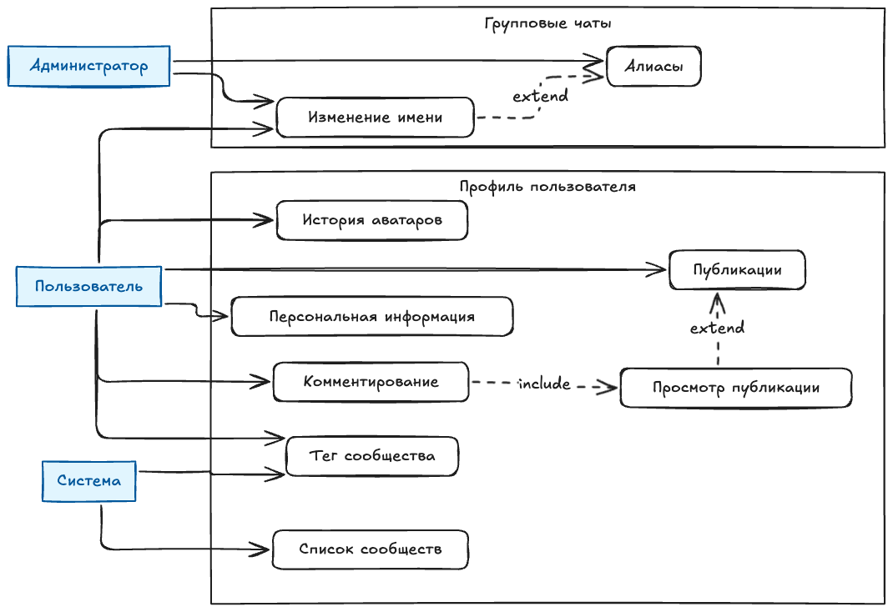

# Требования к системе

## 1. Диаграмма Use Case

### 1.1. Список акторов

| Актор | Описание | Права и возможности |
|-------|----------|---------------------|
| **Пользователь** | Основной участник системы, владелец профиля. Может быть как обычным участником чатов, так и создателем личных групп. | • Редактировать свой профиль (аватар, статус, персональные данные) • Создавать и редактировать посты (текст, фото, видео) • Комментировать посты (свои и чужие, где разрешено) • Указывать день рождения, адрес, любимый трек • Создавать личную группу (приватное пространство) • Менять своё отображаемое имя в групповых чатах |
| **Администратор группы** | Пользователь с расширенными правами в конкретном групповом чате. Назначается создателем группы или вышестоящим админом. | • Назначать алиасы (роли/вторые имена) участникам группы • Изменять отображаемое имя любого участника в контексте группы • Модерировать контент группы |
| **Система** | Автоматизированный компонент плагина, выполняющий фоновые операции без прямого участия пользователя. | • Автоматически подставлять тег сообщества к имени пользователя (постфикс) • Формировать и обновлять список сообществ, в которых состоит пользователь • Валидировать данные профиля (формат даты, адреса и т.д.) • Хранить историю изменений (например, аватаров) |

### 1.2. Прецеденты использования

*Рисунок 1 — Диаграмма Use Case*

Диаграмма Use Case отражает функциональные требования к системе управления профилем пользователя и групповыми чатами.

**Прецеденты:**
- Управление профилем пользователя включает: историю аватаров, комментирование, публикации, персональную информацию, тег сообщества, список сообществ, просмотр публикации
- Управление групповыми чатами включает: алиасы (назначение ролей), изменение имени участника

**Связи между прецедентами:**
- Отношение `include` (включение): комментирование включает просмотр публикации
- Отношение `extend` (расширение): просмотр публикации расширяет публикации; изменение имени расширяет алиасы

---

## 2. Domain Model (Модель предметной области)

### 2.1. Многоуровневая архитектура

*Рисунок 2 — Domain Model (модель предметной области)*

Модель построена с использованием многоуровневой архитектуры, характерной для enterprise-приложений на платформе Spring:

1. **Controller Layer** — слой обработки HTTP запросов, валидации входных данных и маппинга DTO
2. **Service Layer** — слой бизнес-логики, транзакций и оркестрации репозиториев
3. **Repository Layer** — слой доступа к данным, CRUD операции
4. **Entity Layer** — слой моделей данных, маппинг на таблицы БД
5. **DTO Layer** — слой передачи данных между слоями, скрытие внутренней структуры
6. **Exception Layer** — слой обработки ошибок и HTTP статусов

### 2.2. Описание ключевых сущностей

| Слой | Компоненты | Ответственность | Аннотации Spring |
|------|-----------|-----------------|------------------|
| Controller | `UserController`, `PostController`, `CommentController`, `CommunityController` | Обработка HTTP запросов, валидация входных данных, маппинг DTO | `@RestController`, `@RequestMapping`, `@GetMapping`, `@PostMapping` |
| Service | `UserService`, `PostService`, `CommentService`, `GroupService`, `CommunityService` | Бизнес-логика, транзакции, оркестрация репозиториев | `@Service`, `@Transactional` |
| Repository | `UserRepository`, `PostRepository`, `AvatarRepository`, `GroupMemberRepository`, `CommunityRepository` | Доступ к данным, CRUD операции | `@Repository`, `extends JpaRepository` |
| Entity | `User`, `PersonalInfo`, `Avatar`, `Post`, `Comment`, `GroupChat`, `GroupMember`, `Community` | Модель данных, маппинг на таблицы БД | `@Entity`, `@Table`, `@Id`, `@ManyToOne`, `@OneToOne` |
| DTO | `UserDTO`, `PostDTO`, `PersonalInfoDTO`, `AvatarDTO`, `GroupMemberDTO` | Передача данных между слоями, скрытие внутренней структуры | Plain Java Classes |
| Exception | `ValidationException`, `NotFoundException`, `AccessDeniedException` | Обработка ошибок, HTTP статусы | `@ResponseStatus`, `@ControllerAdvice` |

---

## 3. Бизнес-правила и ограничения

| Правило | Описание | Последствия нарушения |
|---------|----------|----------------------|
| BR-001 | Один пользователь = один активный аватар | Конфликт отображения профиля |
| BR-002 | Алиас может назначить только администратор группы | Нарушение прав доступа |
| BR-003 | Личная группа может быть только одна на пользователя | Конфликт приватного пространства |
| BR-004 | Тег сообщества отображается только для активных участников | Некорректная информация о членстве |
| BR-005 | Изменение имени в группе не влияет на глобальное имя | Путаница в идентификации пользователя |

---

## 4. Спецификация прецедентов

### 4.1. UC3: Управление публикациями

| Параметр | Значение |
|----------|----------|
| ID | UC3 |
| Наименование | Управление публикациями (Создание/Редактирование) |
| Акторы | Пользователь (Инициатор), Система (Поддержка) |
| Уровень | Цель пользователя |
| Описание | Создание новой публикации (текст, видео, изображение) или редактирование существующей в профиле пользователя. |
| Связи | `UC7 (Просмотр публикации)` расширяет этот вариант. `UC2 (Комментирование)` включает просмотр. |

**Предусловия:**
1. Пользователь авторизован.
2. У пользователя есть права на публикацию контента (нет бана).
3. Размер контента не превышает лимиты системы.

**Постусловия:**
1. Публикация создана и отображается в ленте профиля.
2. Уведомления отправлены подписчикам (если применимо).
3. Счётчик публикаций пользователя увеличен.

**Основной поток:**
1. **Пользователь** нажимает кнопку «Создать пост».
2. **Система** открывает редактор публикаций.
3. **Пользователь** вводит текст и/или загружает медиа (фото, видео).
4. **Пользователь** инициирует действие «Опубликовать».
5. **Система** выполняет проверку контента (модерация/валидация размера).
6. **Система** сохраняет публикацию и присваивает уникальный ID.
7. **Система** отображает успешное сообщение и переходит к **UC7 (Просмотр публикации)**.
8. **Пользователь** видит опубликованный пост.

**Подпотоки:**
- **3a. Добавление нескольких медиа:** Пользователь загружает галерею (до 10 файлов). Система обрабатывает каждую позицию отдельно.
- **4a. Черновик:** Пользователь выбирает «Сохранить в черновики». Публикация не видна другим, сохраняется как черновик.
- **4b. Предпросмотр (Расширение UC7):** Перед шагом 5 Пользователь может нажать «Предпросмотр». Система показывает, как пост будет выглядеть для других.

**Потоки исключений:**
- **3b. Ошибка загрузки медиа:** Файл повреждён или формат не поддерживается. **Система** отклоняет файл, предлагает выбрать другой. Возврат к шагу 3.
- **5b. Нарушение правил контента:** Автомодерация обнаружила запрещённый контент. **Система** блокирует публикацию, показывает причину отказа.
- **5c. Превышение лимита:** Пользователь достиг дневного лимита публикаций. **Система** сообщает о лимите, публикация отменяется.
- **6b. Дублирование контента:** Система обнаружила идентичный пост, отправленный недавно (защита от спама). Публикация отклоняется.

---

### 4.2. UC4: Управление персональной информацией

| Параметр | Значение |
|----------|----------|
| ID | UC4 |
| Наименование | Управление персональной информацией |
| Акторы | Пользователь (Инициатор), Система (Поддержка) |
| Уровень | Цель пользователя |
| Описание | Позволяет пользователю просматривать, редактировать и сохранять личные данные профиля (день рождения, адрес, любимый трек, статус). |
| Связи | Зависит от аутентификации. Данные валидируются Системой. |

**Предусловия:**
1. Пользователь успешно авторизован в мессенджере.
2. Профиль пользователя существует и доступен для редактирования.
3. Плагин имеет разрешение на доступ к данным профиля.

**Постусловия:**
1. Изменённые данные сохранены в базе данных.
2. Отображение профиля обновлено для всех видимых пользователей.
3. История изменений зафиксирована (для критических данных).

**Основной поток:**
1. **Пользователь** открывает раздел редактирования профиля.
2. **Система** загружает текущие значения полей (День рождения, Адрес, Трек, Статус).
3. **Пользователь** вносит изменения в одно или несколько полей.
4. **Пользователь** нажимает кнопку «Сохранить».
5. **Система** выполняет валидацию введённых данных (формат даты, длина строки).
6. **Система** сохраняет изменения.
7. **Система** отображает уведомление об успешном обновлении.
8. **Пользователь** возвращается к просмотру профиля.

**Подпотоки:**
- **4a. Частичное обновление:** Пользователь редактирует только одно поле (например, только Статус). Система обновляет только это поле, остальные остаются без изменений.
- **5a. Загрузка медиа (для Трека):** Если поле «Любимый трек» требует загрузки файла или обложки, активируется подпроцесс загрузки медиа.

**Потоки исключений:**
- **5b. Ошибка валидации:** Если данные не соответствуют формату (например, дата рождения в будущем), **Система** подсвечивает поле ошибкой и блокирует сохранение. Возврат к шагу 3.
- **6b. Ошибка сервера:** При сохранении произошла сетевая ошибка. **Система** показывает сообщение «Не удалось сохранить». Данные не теряются (остаются в форме). Возврат к шагу 4.
- **1b. Доступ запрещён:** Если профиль заблокирован или доступен только для чтения. **Система** скрывает кнопку редактирования.
