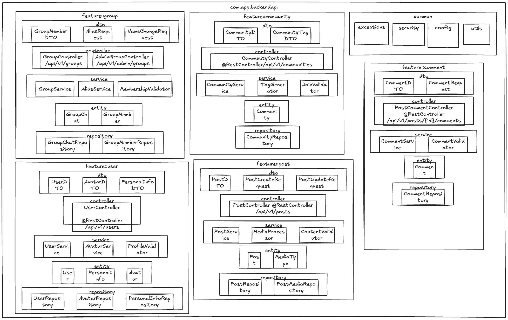
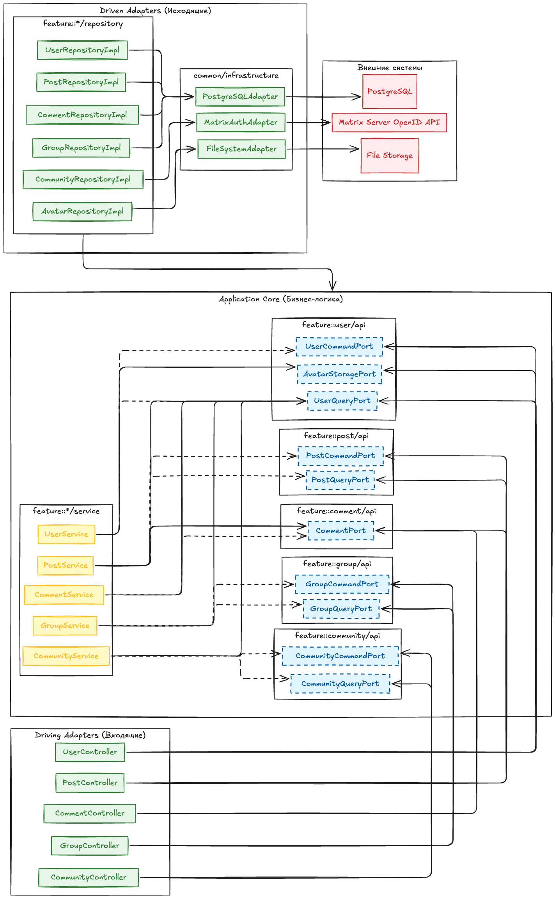
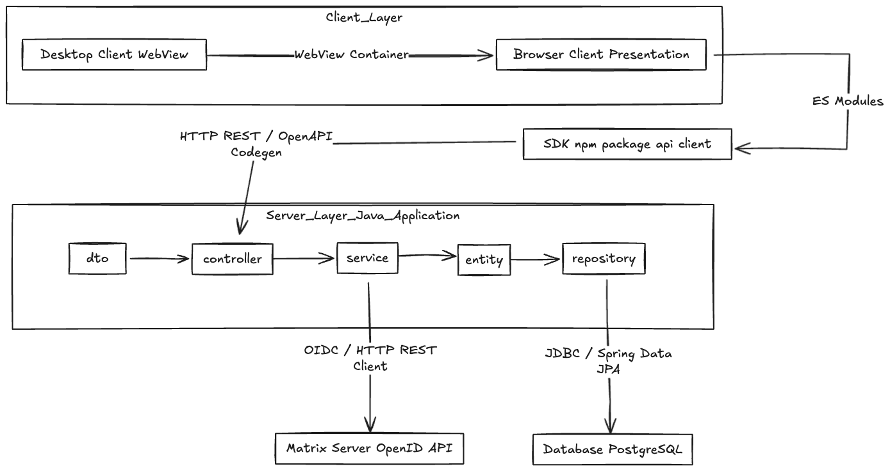

# Архитектурный документ (Arc42)

Проект: msocial (Matrix Social Network)  
Траектория: Web / Enterprise  
Версия: 1.0  
Дата: 30.05.2026  
Автор: Иванов Дмитрий Романович, ПИЖ-б-о-23-2

---

## 1. Введение и цели

### 1.1. Краткое описание системы

msocial — это система управления профилем пользователя и групповыми чатами для мессенджера на базе протокола Matrix. Предоставляет функционал управления профилем (аватар, персональные данные, публикации), групповыми чатами (алиасы, управление участниками) и сообществами.

Система реализована как монолитное приложение-плагин к серверу Matrix. Разделение на клиентскую и серверную части не предусмотрено — вся логика выполняется на стороне сервера. Клиентская часть представлена стандартным Matrix-клиентом, взаимодействующим с сервером через REST API, обрабатываемый слоем Control.

### 1.2. Цели архитектуры

| Цель | Описание |
|------|----------|
| Разделение ответственности | Чёткое разделение UI, бизнес-логики и доступа к данным |
| Тестируемость | Каждый слой должен тестироваться изолированно |
| Масштабируемость | Возможность добавления новых функций без переписывания |
| Поддерживаемость | Лёгкость внесения изменений |

### 1.3. Стейкхолдеры

| Стейкхолдер | Интересы |
|-------------|----------|
| Разработчики | Понятная структура, независимость компонентов |
| Проверяющий | Соответствие PCMEF |
| Заказчик (учебный) | Работоспособность системы |

---

## 2. Ограничения

### 2.1. Технические ограничения

| Ограничение | Значение |
|-------------|----------|
| Язык серверной части | Java 25 |
| Фреймворк | Spring Boot 3.x |
| База данных | PostgreSQL |
| Клиент | Web (REST API + TypeScript SDK) |

### 2.2. Бизнес-ограничения

| Ограничение | Значение |
|-------------|----------|
| Бюджет | 0 руб. (учебный проект) |
| Сроки | 1 семестр (18 недель) |
| Команда | 1 разработчик |

---

## 3. Контекст системы

### 3.1. Бизнес-контекст

Основная функция системы — управление профилем пользователя и групповыми чатами в экосистеме Matrix.

Входы: OpenID токены от Matrix-сервера, пользовательские данные профиля, медиафайлы.  
Выходы: JWT-токены, профили пользователей, публикации, комментарии.

### 3.2. Технический контекст

```
┌─────────────┐     ┌─────────────┐     ┌─────────────┐
│ Пользователь│     │Администратор│     │ Matrix      │
│             │     │  группы     │     │ Сервер      │
└──────┬──────┘     └──────┬──────┘     └──────┬──────┘
       │                   │                   │
       └───────────────────┼───────────────────┘
                           │ REST / JSON
                   ┌───────▼───────┐
                   │   msocial     │
                   │  (Spring Boot)│
                   └───────┬───────┘
                           │ JDBC
                   ┌───────▼───────┐
                   │  PostgreSQL   │
                   └───────────────┘
```

---

## 4. Стратегии

### 4.1. Стратегия декомпозиции

Система декомпозирована по слоям архитектурного паттерна PCMEF с адаптацией под feature-first.

Детали выбора PCMEF: [`02-architecture/adr/adr-001.md`](adr/adr-001.md)

| Слой | Расположение | Ответственность |
|------|-------------|-----------------|
| Presentation (P) | DTO, SDK | Форматы данных API |
| Control (C) | Spring Boot | REST API, валидация |
| Mediator (M) | Spring Boot | Бизнес-логика, транзакции |
| Entity (E) | Spring Boot | JPA-сущности |
| Foundation (F) | Spring Boot | Доступ к данным |

### 4.2. Стратегия управления данными

- Реляционная БД PostgreSQL
- Spring Data JPA для ORM
- Транзакции через `@Transactional`
- Flyway для миграций

### 4.3. Стратегия безопасности

Детали: [`02-architecture/adr/adr-003-auth-strategy.md`](adr/adr-003-auth-strategy.md)

- Аутентификация через Matrix OpenID Federation
- Внутренние JWT для авторизации
- Роли: ROLE_USER
- Оптимистичные блокировки (`@Version`) для сессий

---

## 5. Вид компонентов (структура)

### 5.1. Распределение слоёв PCMEF



*Рисунок 1 — Диаграмма пакетов PCMEF backend-слоя*

| Слой PCMEF | Компоненты проекта | Назначение |
|-----------|-------------------|------------|
| Presentation | `UserDTO`, `PostDTO`, `CommentDTO`, `CommunityDTO`, `GroupMemberDTO`, `PersonalInfoDTO`, `AvatarDTO`, `PostCreateRequest`, `PostUpdateRequest`, `CommentRequest`, `AliasRequest`, `NameChangeRequest`, `CommunityTagDTO` | Форматы данных API, маппинг запросов/ответов |
| Control | `UserController`, `PostController`, `CommentController`, `GroupController`, `CommunityController` | Обработка HTTP-запросов, валидация, маршрутизация |
| Mediator | `UserService`, `PostService`, `CommentService`, `GroupService`, `CommunityService`, `AvatarService`, `MediaProcessor`, `TagGenerator`, `ProfileValidator`, `ContentValidator`, `CommentValidator`, `MembershipValidator`, `JoinValidator`, `AliasService` | Бизнес-логика, транзакции, оркестрация |
| Entity | `User`, `Post`, `Comment`, `GroupChat`, `GroupMember`, `Community`, `PersonalInfo`, `Avatar`, `MediaType` | Модели предметной области, ORM-маппинг |
| Foundation | `UserRepository`, `PostRepository`, `PostMediaRepository`, `CommentRepository`, `GroupChatRepository`, `GroupMemberRepository`, `CommunityRepository`, `AvatarRepository`, `PersonalInfoRepository` | Доступ к данным, CRUD-операции |

### 5.2. Гексагональные порты и интерфейсы



*Рисунок 3 — Диаграмма интерфейсов (Ports & Adapters)*

### 5.3. Feature-first структура пакетов

```
com.app.backendapi
├── feature/
│   ├── user/
│   │   ├── dto/           ← Presentation
│   │   ├── controller/    ← Control
│   │   ├── service/       ← Mediator
│   │   ├── entity/        ← Entity
│   │   └── repository/    ← Foundation
│   ├── post/              (аналогично)
│   ├── comment/           (аналогично)
│   ├── group/             (аналогично)
│   └── community/         (аналогично)
├── common/
│   ├── exceptions/
│   ├── security/
│   ├── config/
│   └── utils/
```

### 5.3. Интерфейсы между слоями

Полные тексты интерфейсов: [`02-architecture/interfaces/`](interfaces/)

**Control → Mediator (IService):**

```java
public interface UserService {
    User getUserById(Long id);
    User updateProfile(Long id, ProfileUpdateRequest dto);
    Avatar updateAvatar(Long id, MultipartFile file);
    List<Avatar> getAvatarHistory(Long id);
}
```

**Mediator → Foundation (IRepository):**

```java
public interface UserRepository extends JpaRepository<User, Long> {
    Optional<User> findById(Long id);
    User save(User user);
    void deleteById(Long id);
    boolean existsById(Long id);
}
```

### 5.4. Гексагональные порты

Для обеспечения слабой связанности между фичами введены гексагональные порты:

| Порт | Методы | Описание |
|------|--------|----------|
| `UserQueryPort` | `getUser(id)`, `exists(id)` | Чтение данных пользователя |
| `UserCommandPort` | `save(user)`, `delete(id)` | Запись данных пользователя |
| `PostQueryPort` | `getPost(id)`, `getUserPosts(userId)` | Чтение данных публикаций |
| `PostCommandPort` | `save(post)`, `delete(id)` | Запись данных публикаций |
| `CommentPort` | `getComments(postId)`, `add(comment)`, `delete(id)` | Управление комментариями |
| `GroupQueryPort` | `getGroup(id)`, `getMembers(groupId)` | Чтение данных групп |
| `GroupCommandPort` | `save(group)`, `addMember(g, u)`, `removeMember(g, u)` | Запись данных групп |
| `CommunityQueryPort` | `getCommunity(id)`, `getUserCommunities(userId)` | Чтение данных сообществ |
| `CommunityCommandPort` | `save(community)`, `join(id, u)`, `leave(id, u)` | Запись данных сообществ |
| `AvatarStoragePort` | `store(file)`, `load(id)`, `delete(id)` | Хранение и загрузка аватаров |
| `MatrixAuthPort` | `authenticate(token)`, `validateSession(id)` | Аутентификация через Matrix-сервер |

---

## 6. Вид выполнения (сценарии)

Подробные диаграммы последовательности: [`04-detailed-design/sequence-diagrams.md`](../04-detailed-design/sequence-diagrams.md)

Краткое описание ключевого сценария «Создание публикации»:

```
UI → SDK → Controller → Service → Repository → DB
```

1. Пользователь нажимает «Создать пост»
2. SDK отправляет POST запрос
3. Controller вызывает Service
4. Service выполняет валидацию контента
5. Repository сохраняет публикацию
6. Ответ возвращается пользователю

---

## 7. Вид развёртывания

### 7.1. Диаграмма развёртывания



*Рисунок 2 — Диаграмма инфраструктуры и развёртывания*

```
┌─────────────┐     HTTP      ┌─────────────┐     JDBC      ┌─────────────┐
│   Клиент    │ ─────────────→│   msocial   │ ────────────→ │  PostgreSQL │
│  (Browser)  │               │  (K8s Pod)  │               │   (K8s /    │
└─────────────┘               └─────────────┘               │  External)  │
                                    │                       └─────────────┘
                                    │ OIDC
                                    ▼
                              ┌─────────────┐
                              │Matrix Server│
                              └─────────────┘
```

### 7.2. Инфраструктурные связи

| Связь | Инструмент / Протокол | Назначение |
|-------|----------------------|------------|
| Desktop → Browser | WebView Container / Localhost URL | Десктопная оболочка загружает SPA в изолированный WebView |
| Browser → SDK | ES Modules / NPM Import | Презентационный слой импортирует SDK для типизированных вызовов |
| SDK → Controller | HTTP REST / OpenAPI Codegen | SDK генерируется из OpenAPI спецификации сервера |
| Repository → PostgreSQL | JDBC / Spring Data JPA | Репозитории преобразуют запросы в SQL через ORM пул соединений (HikariCP) |
| Service → MatrixOpenID | OIDC / HTTP REST Client | Сервис вызывает OpenID API для федерации аутентификации |

---

## 8. Скрещённые концепции

### 8.1. Безопасность

- Аутентификация: Matrix OpenID + внутренние JWT
- Авторизация: Bearer-токены, роли ROLE_USER
- Сессии: хранение в PostgreSQL с возможностью отзыва

### 8.2. Транзакции

- Управление через `@Transactional`
- Уровень изоляции: READ_COMMITTED

### 8.3. Валидация

- Декларативная: Jakarta Bean Validation (`@Valid`, `@NotBlank`)
- Программная: `ProfileValidator`, `ContentValidator`, `CommentValidator`

---

## 9. Архитектурные решения (ADR)

Все ADR находятся в папке: [`02-architecture/adr/`](adr/)

| № | Название | Статус |
|---|----------|--------|
| ADR-001 | Выбор архитектурного паттерна | Принято |
| ADR-002 | Выбор базы данных и ORM | Принято |
| ADR-003 | Стратегия аутентификации | Принято |

---

## 10. Качество

| Атрибут | Целевое значение | Способ проверки |
|---------|-----------------|-----------------|
| Тестируемость | Покрытие >40% | JaCoCo |
| Производительность | Время отклика < 200 мс | JMeter |

---

## 11. Риски

| Риск | Митигация |
|------|-----------|
| N+1 проблема в JPA | Использовать `@EntityGraph`, FETCH JOIN |
| Безопасность JWT на клиенте | HttpOnly cookies, короткое время жизни access-токена |
| Зависимость от Matrix-сервера | Dev-режим с `skipVerify` для локальной разработки |

---

## 12. Глоссарий

| Термин | Определение |
|--------|-------------|
| PCMEF | Presentation, Control, Mediator, Entity, Foundation |
| JWT | JSON Web Token |
| ADR | Architecture Decision Record |
| OIDC | OpenID Connect |
| SDK | Software Development Kit |
