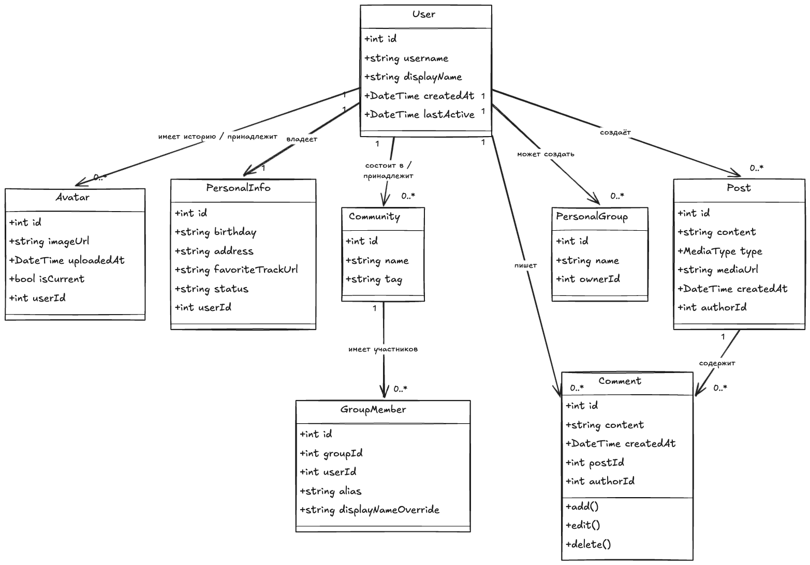

# Схема базы данных

## 1. Логическая модель данных (ER-диаграмма)



*Рисунок 1 — Domain Model (модель предметной области)*

Система содержит 8 основных сущностей:

- **User** — центральная сущность, хранит данные пользователя
- **PersonalInfo** — личная информация (1:1 с User)
- **Avatar** — история аватаров (1:N с User)
- **Community** — сообщества
- **PersonalGroup** — личные группы (1:N с User)
- **GroupMember** — участники сообществ (M:N через ассоциативную сущность)
- **Post** — публикации (N:1 с User)
- **Comment** — комментарии (N:1 с Post, N:1 с User)

---

## 2. Нормализация до третьей нормальной формы (3НФ)

| Форма | Что было в Domain Model | Что исправлено для РСУБД |
|-------|------------------------|--------------------------|
| **1НФ** | birthday: string, методы add/edit/delete, отсутствие типов у полей | Типы приведены к атомарным SQL-типам (DATE, VARCHAR, TIMESTAMP). Методы удалены (относятся к слою бизнес-логики, а не к данным). |
| **2НФ** | Все сущности имеют суррогатный ключ id. Частичные зависимости отсутствуют. | Таблицы оставлены без изменений, т.к. все неключевые атрибуты зависят от полного первичного ключа. |
| **3НФ** | PersonalInfo и User связаны 1:1, но без уникальности. isCurrent в Avatar может дублироваться. GroupMember допускает дубли пар (groupId, userId). | Добавлены UNIQUE ограничения: user_id в personal_infos (гарантия 1:1), частичный индекс для is_current = TRUE, уникальный композитный ключ (group_id, user_id). |

---

## 3. DDL-скрипты

```sql
-- Пользователи
CREATE TABLE users (
    id SERIAL PRIMARY KEY,
    username VARCHAR(50) NOT NULL UNIQUE,
    display_name VARCHAR(100) NOT NULL,
    created_at TIMESTAMP WITH TIME ZONE NOT NULL DEFAULT NOW(),
    last_active TIMESTAMP WITH TIME ZONE
);

-- Личная информация (1:1 с пользователем)
CREATE TABLE personal_infos (
    id SERIAL PRIMARY KEY,
    user_id INTEGER NOT NULL UNIQUE,
    birthday DATE,
    address VARCHAR(255),
    favorite_track_url VARCHAR(512),
    status VARCHAR(255),
    CONSTRAINT fk_personal_info_user FOREIGN KEY (user_id) 
        REFERENCES users(id) ON DELETE CASCADE
);

-- Аватары (история загрузок)
CREATE TABLE avatars (
    id SERIAL PRIMARY KEY,
    user_id INTEGER NOT NULL,
    image_url VARCHAR(512) NOT NULL,
    uploaded_at TIMESTAMP WITH TIME ZONE NOT NULL DEFAULT NOW(),
    is_current BOOLEAN NOT NULL DEFAULT FALSE,
    CONSTRAINT fk_avatar_user FOREIGN KEY (user_id) 
        REFERENCES users(id) ON DELETE CASCADE
);

CREATE UNIQUE INDEX idx_current_avatar ON avatars(user_id)
    WHERE is_current = TRUE;

-- Сообщества
CREATE TABLE communities (
    id SERIAL PRIMARY KEY,
    name VARCHAR(100) NOT NULL,
    tag VARCHAR(50) NOT NULL UNIQUE
);

-- Личные группы
CREATE TABLE personal_groups (
    id SERIAL PRIMARY KEY,
    name VARCHAR(100) NOT NULL,
    owner_id INTEGER NOT NULL,
    CONSTRAINT fk_group_owner FOREIGN KEY (owner_id) 
        REFERENCES users(id) ON DELETE CASCADE
);

-- Участники сообществ (Many-to-Many)
CREATE TABLE group_members (
    id SERIAL PRIMARY KEY,
    group_id INTEGER NOT NULL,
    user_id INTEGER NOT NULL,
    alias VARCHAR(100),
    display_name_override VARCHAR(100),
    CONSTRAINT fk_member_group FOREIGN KEY (group_id) 
        REFERENCES communities(id) ON DELETE CASCADE,
    CONSTRAINT fk_member_user FOREIGN KEY (user_id) 
        REFERENCES users(id) ON DELETE CASCADE,
    CONSTRAINT uq_group_member UNIQUE(group_id, user_id)
);

-- Посты
CREATE TABLE posts (
    id SERIAL PRIMARY KEY,
    author_id INTEGER NOT NULL,
    content TEXT,
    media_type VARCHAR(20) CHECK (media_type IN ('text', 'image', 'video', 'audio', 'link')),
    media_url VARCHAR(512),
    created_at TIMESTAMP WITH TIME ZONE NOT NULL DEFAULT NOW(),
    CONSTRAINT fk_post_author FOREIGN KEY (author_id) 
        REFERENCES users(id) ON DELETE CASCADE
);

-- Комментарии
CREATE TABLE comments (
    id SERIAL PRIMARY KEY,
    post_id INTEGER NOT NULL,
    author_id INTEGER NOT NULL,
    content TEXT NOT NULL,
    created_at TIMESTAMP WITH TIME ZONE NOT NULL DEFAULT NOW(),
    CONSTRAINT fk_comment_post FOREIGN KEY (post_id) 
        REFERENCES posts(id) ON DELETE CASCADE,
    CONSTRAINT fk_comment_author FOREIGN KEY (author_id) 
        REFERENCES users(id) ON DELETE CASCADE
);

-- Индексы для ускорения JOIN и фильтрации
CREATE INDEX idx_avatars_user ON avatars(user_id);
CREATE INDEX idx_posts_author ON posts(author_id);
CREATE INDEX idx_posts_created ON posts(created_at DESC);
CREATE INDEX idx_comments_post ON comments(post_id);
CREATE INDEX idx_comments_author ON comments(author_id);
CREATE INDEX idx_group_members_user ON group_members(user_id);
```

---

## 4. ORM-маппинг (JPA)

### 4.1. Enum MediaType

```java
public enum MediaType { TEXT, IMAGE, VIDEO, AUDIO, LINK }
```

### 4.2. Сущность User

```java
@Entity
@Table(name = "users")
public class User {
    @Id
    @GeneratedValue(strategy = GenerationType.IDENTITY)
    private Long id;

    @Column(nullable = false, unique = true, length = 50)
    private String username;

    @Column(name = "display_name", nullable = false, length = 100)
    private String displayName;

    @Column(name = "created_at", nullable = false, updatable = false)
    private LocalDateTime createdAt = LocalDateTime.now();

    @Column(name = "last_active")
    private LocalDateTime lastActive;

    @OneToOne(mappedBy = "user", cascade = CascadeType.ALL, orphanRemoval = true, fetch = FetchType.LAZY)
    private PersonalInfo personalInfo;

    @OneToMany(mappedBy = "user", cascade = CascadeType.PERSIST, fetch = FetchType.LAZY)
    private List<Avatar> avatars = new ArrayList<>();

    @OneToMany(mappedBy = "owner", fetch = FetchType.LAZY)
    private List<PersonalGroup> ownedGroups = new ArrayList<>();

    @OneToMany(mappedBy = "author", fetch = FetchType.LAZY)
    private List<Post> posts = new ArrayList<>();

    @OneToMany(mappedBy = "author", fetch = FetchType.LAZY)
    private List<Comment> comments = new ArrayList<>();

    @OneToMany(mappedBy = "user", fetch = FetchType.LAZY)
    private List<GroupMember> groupMemberships = new ArrayList<>();
}
```

### 4.3. Сущность PersonalInfo (1:1)

```java
@Entity
@Table(name = "personal_infos")
public class PersonalInfo {
    @Id
    @GeneratedValue(strategy = GenerationType.IDENTITY)
    private Long id;

    @OneToOne(fetch = FetchType.LAZY)
    @JoinColumn(name = "user_id", nullable = false, unique = true)
    private User user;

    private LocalDate birthday;
    private String address;

    @Column(name = "favorite_track_url", length = 512)
    private String favoriteTrackUrl;
    private String status;
}
```

### 4.4. Сущность Avatar

```java
@Entity
@Table(name = "avatars")
public class Avatar {
    @Id
    @GeneratedValue(strategy = GenerationType.IDENTITY)
    private Long id;

    @ManyToOne(fetch = FetchType.LAZY)
    @JoinColumn(name = "user_id", nullable = false)
    private User user;

    @Column(name = "image_url", nullable = false, length = 512)
    private String imageUrl;

    @Column(name = "uploaded_at", nullable = false, updatable = false)
    private LocalDateTime uploadedAt = LocalDateTime.now();

    @Column(name = "is_current", nullable = false)
    private boolean current = false;
}
```

### 4.5. Сущности Community и GroupMember

```java
@Entity
@Table(name = "communities")
public class Community {
    @Id @GeneratedValue(strategy = GenerationType.IDENTITY)
    private Long id;

    @Column(nullable = false, length = 100)
    private String name;

    @Column(nullable = false, unique = true, length = 50)
    private String tag;

    @OneToMany(mappedBy = "community", fetch = FetchType.LAZY)
    private List<GroupMember> members = new ArrayList<>();
}

@Entity
@Table(name = "group_members", 
       uniqueConstraints = @UniqueConstraint(columnNames = {"group_id", "user_id"}))
public class GroupMember {
    @Id @GeneratedValue(strategy = GenerationType.IDENTITY)
    private Long id;

    @ManyToOne(fetch = FetchType.LAZY)
    @JoinColumn(name = "group_id", nullable = false)
    private Community community;

    @ManyToOne(fetch = FetchType.LAZY)
    @JoinColumn(name = "user_id", nullable = false)
    private User user;

    private String alias;

    @Column(name = "display_name_override", length = 100)
    private String displayNameOverride;
}
```

### 4.6. Сущности Post и Comment

```java
@Entity
@Table(name = "posts")
public class Post {
    @Id @GeneratedValue(strategy = GenerationType.IDENTITY)
    private Long id;

    @ManyToOne(fetch = FetchType.LAZY)
    @JoinColumn(name = "author_id", nullable = false)
    private User author;

    @Column(columnDefinition = "TEXT")
    private String content;

    @Enumerated(EnumType.STRING)
    @Column(name = "media_type", length = 20)
    private MediaType mediaType;

    @Column(name = "media_url", length = 512)
    private String mediaUrl;

    @Column(name = "created_at", nullable = false, updatable = false)
    private LocalDateTime createdAt = LocalDateTime.now();

    @OneToMany(mappedBy = "post", cascade = CascadeType.ALL, orphanRemoval = true, fetch = FetchType.LAZY)
    private List<Comment> comments = new ArrayList<>();
}

@Entity
@Table(name = "comments")
public class Comment {
    @Id @GeneratedValue(strategy = GenerationType.IDENTITY)
    private Long id;

    @ManyToOne(fetch = FetchType.LAZY)
    @JoinColumn(name = "post_id", nullable = false)
    private Post post;

    @ManyToOne(fetch = FetchType.LAZY)
    @JoinColumn(name = "author_id", nullable = false)
    private User author;

    @Column(nullable = false, columnDefinition = "TEXT")
    private String content;

    @Column(name = "created_at", nullable = false, updatable = false)
    private LocalDateTime createdAt = LocalDateTime.now();
}
```

### 4.7. Сущность PersonalGroup

```java
@Entity
@Table(name = "personal_groups")
public class PersonalGroup {
    @Id @GeneratedValue(strategy = GenerationType.IDENTITY)
    private Long id;

    @Column(nullable = false, length = 100)
    private String name;

    @ManyToOne(fetch = FetchType.LAZY)
    @JoinColumn(name = "owner_id", nullable = false)
    private User owner;
}
```

---

## 5. Спецификация отображения классов на таблицы

### 5.1. User

| Поле | Тип | Ограничения | Аннотация |
|------|-----|-------------|-----------|
| id | Long | PK, GENERATED | `@Id`, `@GeneratedValue` |
| username | String | NOT NULL, UNIQUE, length=50 | `@Column` |
| displayName | String | NOT NULL, length=100 | `@Column(name="display_name")` |
| createdAt | LocalDateTime | NOT NULL, updatable=false | `@Column(name="created_at")` |
| lastActive | LocalDateTime | nullable | `@Column(name="last_active")` |

### 5.2. PersonalInfo

| Поле | Тип | Ограничения | Аннотация |
|------|-----|-------------|-----------|
| id | Long | PK, GENERATED | `@Id`, `@GeneratedValue` |
| user | User | FK, NOT NULL, UNIQUE | `@OneToOne`, `@JoinColumn` |
| birthday | LocalDate | nullable | — |
| address | String | nullable | — |
| favoriteTrackUrl | String | length=512 | `@Column(name="favorite_track_url")` |
| status | String | nullable | — |

### 5.3. Avatar

| Поле | Тип | Ограничения | Аннотация |
|------|-----|-------------|-----------|
| id | Long | PK, GENERATED | `@Id`, `@GeneratedValue` |
| user | User | FK, NOT NULL | `@ManyToOne`, `@JoinColumn` |
| imageUrl | String | NOT NULL, length=512 | `@Column(name="image_url")` |
| uploadedAt | LocalDateTime | NOT NULL, updatable=false | `@Column(name="uploaded_at")` |
| current | boolean | NOT NULL, default=false | `@Column(name="is_current")` |

### 5.4. Community

| Поле | Тип | Ограничения | Аннотация |
|------|-----|-------------|-----------|
| id | Long | PK, GENERATED | `@Id`, `@GeneratedValue` |
| name | String | NOT NULL, length=100 | `@Column` |
| tag | String | NOT NULL, UNIQUE, length=50 | `@Column` |

### 5.5. GroupMember

| Поле | Тип | Ограничения | Аннотация |
|------|-----|-------------|-----------|
| id | Long | PK, GENERATED | `@Id`, `@GeneratedValue` |
| community | Community | FK, NOT NULL | `@ManyToOne`, `@JoinColumn(name="group_id")` |
| user | User | FK, NOT NULL | `@ManyToOne`, `@JoinColumn` |
| alias | String | nullable | — |
| displayNameOverride | String | length=100 | `@Column(name="display_name_override")` |

### 5.6. Post

| Поле | Тип | Ограничения | Аннотация |
|------|-----|-------------|-----------|
| id | Long | PK, GENERATED | `@Id`, `@GeneratedValue` |
| author | User | FK, NOT NULL | `@ManyToOne`, `@JoinColumn(name="author_id")` |
| content | String | TEXT | `@Column(columnDefinition="TEXT")` |
| mediaType | MediaType | enum, length=20 | `@Enumerated(STRING)` |
| mediaUrl | String | length=512 | `@Column(name="media_url")` |
| createdAt | LocalDateTime | NOT NULL, updatable=false | `@Column(name="created_at")` |

### 5.7. Comment

| Поле | Тип | Ограничения | Аннотация |
|------|-----|-------------|-----------|
| id | Long | PK, GENERATED | `@Id`, `@GeneratedValue` |
| post | Post | FK, NOT NULL | `@ManyToOne`, `@JoinColumn(name="post_id")` |
| author | User | FK, NOT NULL | `@ManyToOne`, `@JoinColumn(name="author_id")` |
| content | String | NOT NULL, TEXT | `@Column(columnDefinition="TEXT")` |
| createdAt | LocalDateTime | NOT NULL, updatable=false | `@Column(name="created_at")` |

### 5.8. PersonalGroup

| Поле | Тип | Ограничения | Аннотация |
|------|-----|-------------|-----------|
| id | Long | PK, GENERATED | `@Id`, `@GeneratedValue` |
| name | String | NOT NULL, length=100 | `@Column` |
| owner | User | FK, NOT NULL | `@ManyToOne`, `@JoinColumn(name="owner_id")` |
