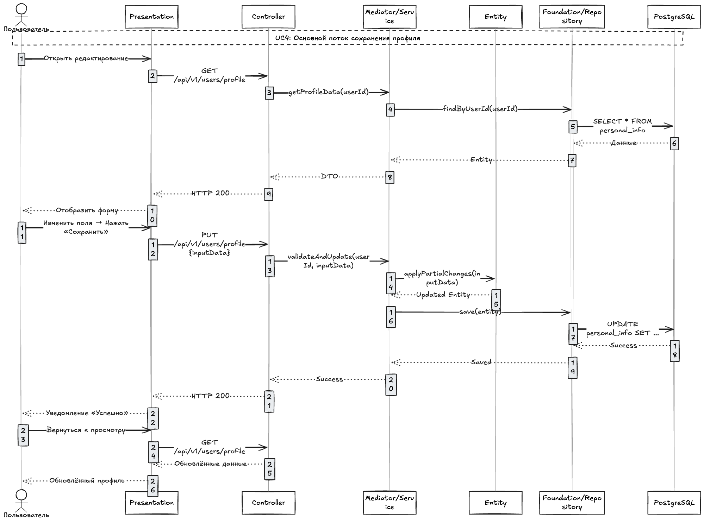
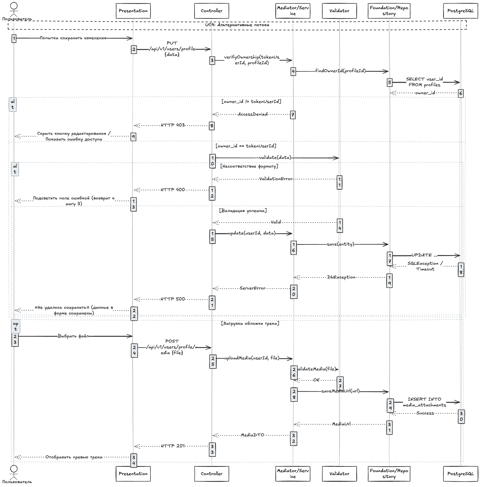
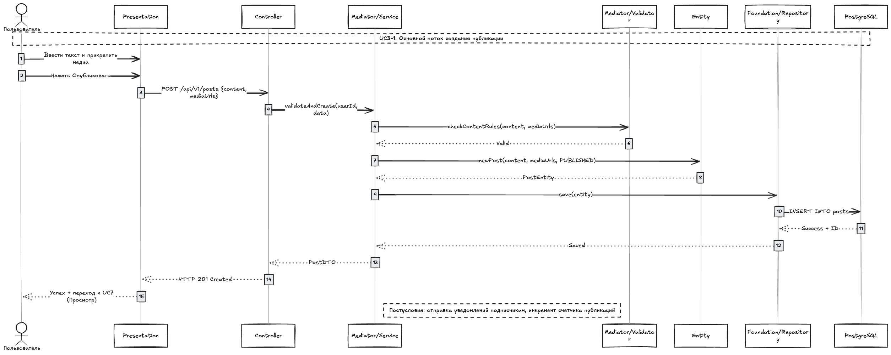
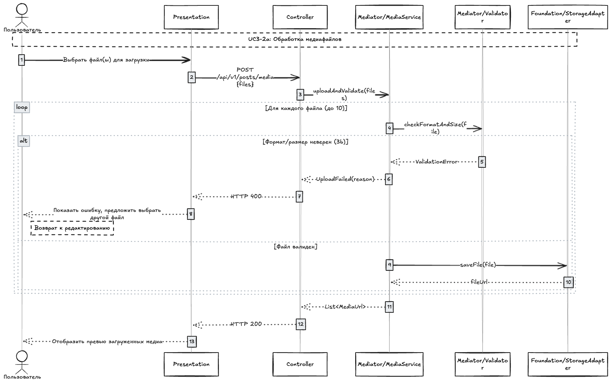
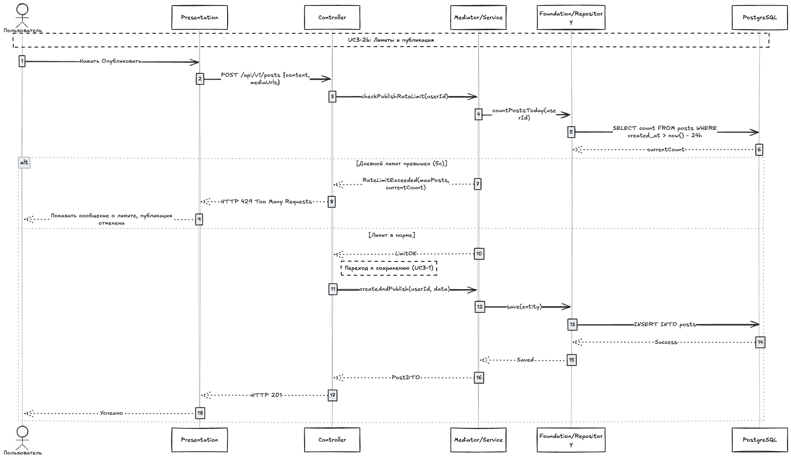
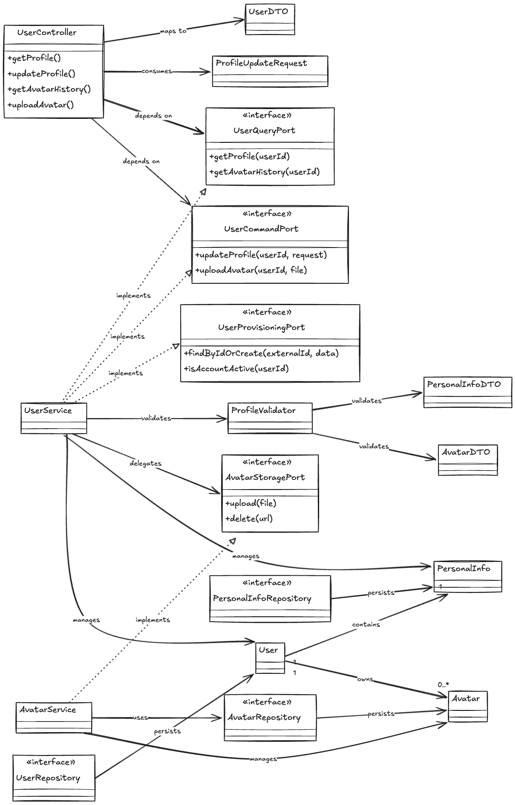
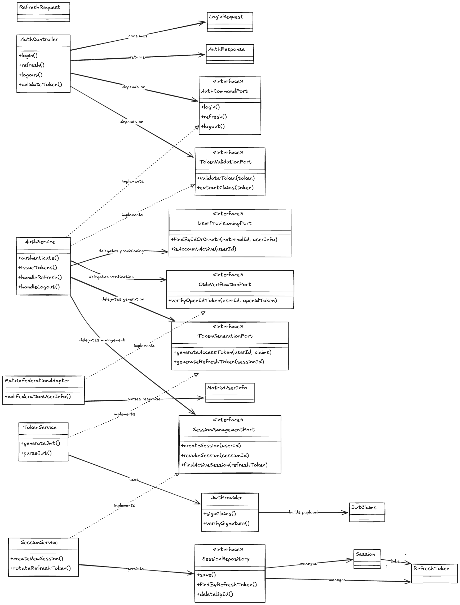
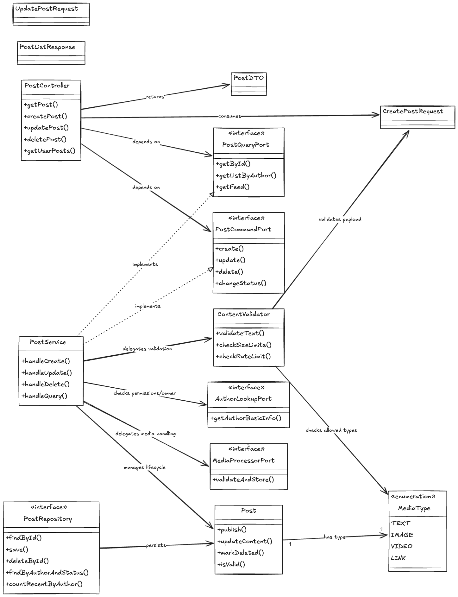
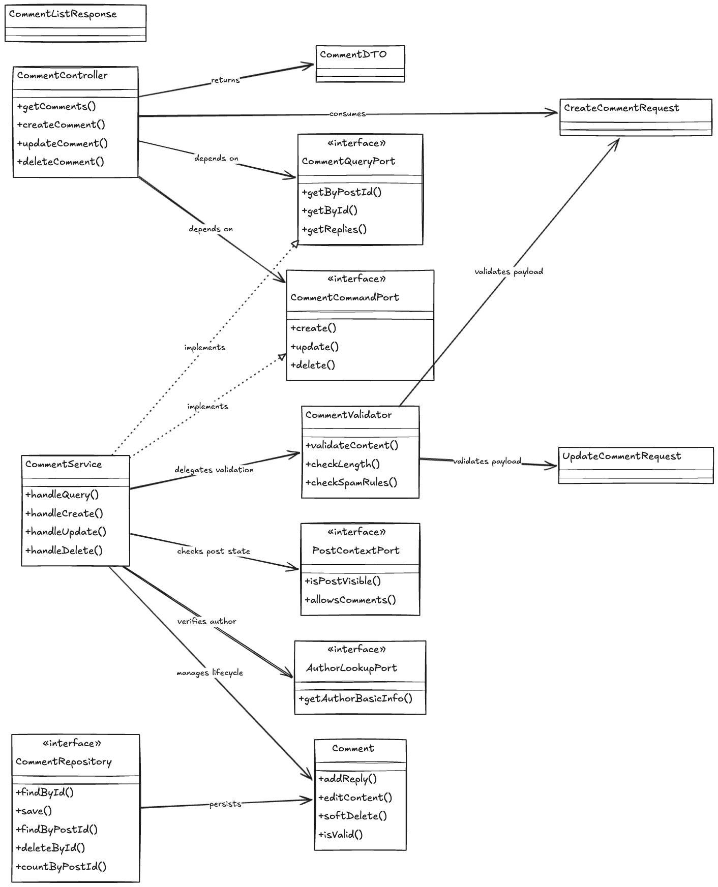

# Детальное проектирование

## 1. Диаграммы последовательности для ключевых сценариев

### 1.1. Выбор сценариев

Для детального проектирования выбраны три ключевых сценария:

1. **UC4: Управление персональной информацией** — сценарий редактирования профиля пользователя, включающий основной поток, альтернативные потоки и обработку ошибок.
2. **UC3: Управление публикациями (создание)** — сценарий создания новой публикации с валидацией контента и сохранением в базу данных.
3. **UC3-2a: Загрузка и валидация медиафайлов** — технический подпоток, демонстрирующий циклическую обработку нескольких файлов с ветвлением по результатам валидации.

Выбор обусловлен тем, что данные сценарии охватывают основные паттерны взаимодействия: синхронные вызовы между слоями PCMEF, циклы, альтернативы (alt/opt) и обработку исключений.

---

### 1.2. UC4: Управление персональной информацией

#### Основной поток сохранения профиля



*Рисунок 1 — Диаграмма последовательности UC4: основной поток сохранения профиля*

```
Пользователь → Presentation → UserController → UserService → 
UserRepository → PostgreSQL
```

Пользователь инициирует редактирование профиля, после чего слой **Presentation** выполняет GET-запрос к **Controller**. Запрос проходит через слои **Controller → Mediator/Service → Foundation/Repository → PostgreSQL** для загрузки текущих данных. Обратный путь следует снизу вверх: данные преобразуются в Entity, затем в DTO и возвращаются пользователю в виде заполненной формы. При сохранении изменений выполняется валидация (шаг 5), частичное обновление Entity и сохранение в базу данных через Repository.

#### Альтернативные потоки



*Рисунок 2 — Диаграмма последовательности UC4: альтернативные потоки*

- **Проверка доступа (1b):** сравнивается `owner_id` из токена с идентификатором профиля. При несовпадении возвращается HTTP 403.
- **Ошибка валидации (5b):** при несоответствии формата данных Validator возвращает ошибку, поле подсвечивается, управление возвращается к шагу 3.
- **Ошибка сервера (6b):** при сетевом сбое или `SQLException` данные остаются в форме, пользователь получает сообщение «Не удалось сохранить».
- **Загрузка медиа (5a):** опциональный блок (opt) для загрузки обложки трека через отдельный endpoint.

---

### 1.3. UC3: Создание публикации



*Рисунок 3 — Диаграмма последовательности UC3-1: создание публикации*

```
Пользователь → Presentation → PostController → PostService → 
ContentValidator → PostRepository → PostgreSQL
```

Пользователь вводит текст и прикрепляет медиа, после чего **Presentation** отправляет POST-запрос. **Controller** делегирует валидацию и создание **Mediator/Service**, который взаимодействует с **Validator**, создаёт **Entity**, сохраняет через **Repository** в PostgreSQL и возвращает `PostDTO` с HTTP 201. Постусловия (уведомление подписчиков, инкремент счётчика) выполняются асинхронно на уровне сервиса.

---

### 1.4. UC3-2a: Загрузка и валидация медиафайлов



*Рисунок 4 — Диаграмма последовательности UC3-2a: обработка медиафайлов*

Для каждого файла (до 10) вызывается валидация формата и размера в цикле (`loop`). При ошибке (3b) загрузка отклоняется с HTTP 400 и предложением выбрать другой файл. При успехе файл сохраняется через **StorageAdapter** (Foundation), и сервис накапливает список URL. Результат возвращается в **Presentation** для отображения превью.

---

### 1.5. UC3-2b: Проверка лимитов и публикация



*Рисунок 5 — Диаграмма последовательности UC3-2b: проверка лимитов*

Перед сохранением **Service** запрашивает количество постов за последние 24 часа. Если лимит превышен (5c), возвращается HTTP 429 и публикация отменяется. В противном случае выполняется стандартное сохранение (переход к UC3-1).

---

## 2. Уточнённые диаграммы классов по доменным областям

### 2.1. Модуль управления пользователями (feature::user)



*Рисунок 6 — Диаграмма классов: управление пользователями*

Модуль выделяет порты `UserQueryPort` и `UserCommandPort`, реализуемые `UserService`. Валидация изолирована в `ProfileValidator`, а хранение медиа абстрагировано через `AvatarStoragePort`.

```
user/
├── api/                          # Ports (Контракты)
│   ├── UserQueryPort.java            # getProfile(), getAvatarHistory()
│   ├── UserCommandPort.java          # updateProfile(), uploadAvatar()
│   ├── UserProvisioningPort.java     # findByIdOrCreate(), isAccountActive()
│   └── AvatarStoragePort.java        # upload(), delete()
├── controller/                   # Control Layer
│   └── UserController.java         # @RestController: /users/profile, /avatars, /update
├── presentation/                 # Presentation Layer
│   ├── UserDTO.java
│   ├── PersonalInfoDTO.java
│   ├── AvatarDTO.java
│   ├── ProfileUpdateRequest.java
│   └── mapper/UserMapper.java
├── service/                      # Mediator/Service Layer
│   ├── UserService.java            # Implements UserQueryPort, UserCommandPort, UserProvisioningPort
│   ├── AvatarService.java          # Implements AvatarStoragePort
│   └── validator/ProfileValidator.java
├── entity/                       # Entity Layer
│   ├── User.java
│   ├── PersonalInfo.java
│   └── Avatar.java
├── repository/                   # Foundation/Repository Layer
│   ├── UserRepository.java
│   ├── PersonalInfoRepository.java
│   └── AvatarRepository.java
└── infrastructure/               # Driven Adapters 
    └── MediaStorageAdapter.java # Implements AvatarStoragePort
```

---

### 2.2. Модуль аутентификации (feature::auth)



*Рисунок 7 — Диаграмма классов: аутентификация*

Модуль интегрируется с Matrix Federation через порт `OidcVerificationPort`. Генерация токенов и управление сессиями разделены на отдельные порты.

```
auth/
├── api/                          # Ports (Контракты)
│   ├── AuthCommandPort.java          # login(), refresh(), logout()
│   ├── TokenValidationPort.java      # validateToken(), extractClaims()
│   ├── OidcVerificationPort.java     # verifyOpenIdToken()
│   ├── TokenGenerationPort.java      # generateAccessToken(), generateRefreshToken()
│   └── SessionManagementPort.java    # createSession(), revokeSession(), findActiveSession()
├── controller/                   # Control Layer
│   └── AuthController.java         # @RestController: /auth/login, /refresh, /logout, /validate
├── presentation/                 # Presentation Layer
│   ├── LoginRequest.java
│   ├── RefreshRequest.java
│   ├── AuthResponse.java
│   └── mapper/AuthMapper.java
├── service/                      # Mediator/Service Layer
│   ├── AuthService.java            # Implements AuthCommandPort, TokenValidationPort
│   ├── TokenService.java           # Implements TokenGenerationPort
│   └── SessionService.java         # Implements SessionManagementPort
├── entity/                       # Entity Layer
│   ├── Session.java
│   ├── RefreshToken.java
│   ├── MatrixUserInfo.java
│   └── JwtClaims.java
├── repository/                   # Foundation/Repository Layer
│   └── SessionRepository.java      # Extends JpaRepository<Session, Long>
└── infrastructure/               # Driven Adapters
    ├── MatrixFederationAdapter.java # Implements OidcVerificationPort
    └── JwtProvider.java            # Криптография: sign(), verify()
```

**Matrix OIDC Flow — пошаговый процесс:**

| Шаг | Класс/Порт | Действие |
|-----|-----------|----------|
| 1. Клиент получает openid_token | (Происходит на клиенте) | Токен передаётся в теле LoginRequest |
| 2. Бэкенд принимает запрос | AuthController → AuthCommandPort | Валидация структуры запроса, вызов AuthService.authenticate() |
| 3. Подтверждение токена | OidcVerificationPort → MatrixFederationAdapter | POST /_matrix/federation/v1/openid/userinfo. Парсинг ответа в MatrixUserInfo |
| 4. Провижининг пользователя | UserProvisioningPort | findByIdOrCreate(matrixUserId, userInfo). Создание или возврат локального пользователя |
| 5. Генерация внутреннего JWT | TokenGenerationPort → TokenService → JwtProvider | Формирование JwtClaims, подпись приватным ключом |
| 6. Управление сессией | SessionManagementPort → SessionService → SessionRepository | Сохранение Session + RefreshToken в БД |
| 7. Возврат токенов | AuthResponse ← AuthController | access_token, refresh_token, expires_in |

---

### 2.3. Модуль публикаций (feature::post)



*Рисунок 8 — Диаграмма классов: публикации*

Модуль использует `ContentValidator` для проверки текста и медиа, а `MediaProcessorPort` абстрагирует хранилище файлов. Сущность `Post` инкапсулирует правила жизненного цикла.

```
post/
├── api/
│   ├── PostQueryPort.java
│   ├── PostCommandPort.java
│   ├── AuthorLookupPort.java
│   └── MediaProcessorPort.java
├── controller/
│   └── PostController.java
├── presentation/
│   ├── PostDTO.java
│   ├── CreatePostRequest.java
│   ├── UpdatePostRequest.java
│   └── mapper/PostMapper.java
├── service/
│   ├── PostService.java
│   └── validator/ContentValidator.java
├── entity/
│   ├── Post.java
│   └── MediaType.java
├── repository/
│   └── PostRepository.java
└── infrastructure/
    └── MediaProcessorAdapter.java
```

---

### 2.4. Модуль комментариев (feature::comment)



*Рисунок 9 — Диаграмма классов: комментарии*

Модуль взаимодействует с постами через `PostContextPort` и с пользователями через `AuthorLookupPort`, реализуемые в других модулях. Это исключает циклические зависимости.

```
comment/
├── api/
│   ├── CommentQueryPort.java
│   ├── CommentCommandPort.java
│   ├── PostContextPort.java
│   └── AuthorLookupPort.java
├── controller/
│   └── CommentController.java
├── presentation/
│   ├── CommentDTO.java
│   ├── CreateCommentRequest.java
│   └── mapper/CommentMapper.java
├── service/
│   ├── CommentService.java
│   └── validator/CommentValidator.java
├── entity/
│   ├── Comment.java
│   └── CommentStatus.java
├── repository/
│   └── CommentRepository.java
└── infrastructure/
    └── PostContextAdapter.java
```

---

## 3. Ключевые архитектурные решения

| Принцип | Реализация | Обоснование |
|---------|-----------|-------------|
| Инверсия зависимостей (DIP) | Контроллеры зависят только от портов, а не от сервисов или репозиториев | Возможность замены реализации (кэш, микросервис, mock) без изменения API-слоя |
| Разделение чтения/записи (CQRS-lite) | `QueryPort` и `CommandPort` разделены для каждой фичи | Упрощение аудита, оптимизации запросов и масштабирование чтения через реплики |
| Изоляция внешних систем | `AvatarStoragePort`, `MediaProcessorPort`, `OidcVerificationPort` | Замена хранилища (S3, CDN) или провайдера аутентификации без изменения бизнес-логики |
| Мягкое удаление | Методы `markDeleted()` и `softDelete()` в сущностях | Сохранение целостности истории и возможность восстановления данных |
| Валидация как отдельный компонент | `ProfileValidator`, `ContentValidator`, `CommentValidator` | Переиспользование правил, подключение AI-модерации без изменения сервисов |

---

## 4. GoF паттерны проектирования

### 4.1. Decorator (Декоратор)

Нужно добавить кеширование, rate-limiting, метрики или логирование к существующим портам, **не меняя** их базовую реализацию и не раздувая сервисы.

```java
@Component
@RequiredArgsConstructor
public class CachedUserQueryPort implements UserQueryPort {
    private final UserQueryPort delegate;
    private final Cache<String, UserProfileDTO> cache;

    @Override
    public UserProfileDTO getProfile(Long userId) {
        return cache.computeIfAbsent("user:" + userId, k -> delegate.getProfile(userId));
    }
}
```

Гексагональные порты — это интерфейсы, идеально подходящие для декорирования. Позволяет **компоновать поведение на лету** без наследования. Spring DI соберёт цепочку автоматически.

---

### 4.2. Chain of Responsibility (Цепочка обязанностей)

Валидация комментариев или постов — это последовательность проверок: длина → спам-паттерны → права доступа. Каждая проверка может прервать цепочку или передать данные дальше.

```java
public abstract class ValidationHandler {
    protected ValidationHandler next;
    public void setNext(ValidationHandler next) { this.next = next; }
    public abstract ValidationResult handle(CommentRequest req);
}

@Component
public class LengthValidator extends ValidationHandler {
    public ValidationResult handle(CommentRequest req) {
        if (req.content().length() > 5000) return ValidationResult.fail("TOO_LONG");
        return next != null ? next.handle(req) : ValidationResult.ok();
    }
}
```

Заменяет огромные `if`-блоки в `CommentValidator`. Конфигурация цепочки выносится в `@Configuration`. Легко включать/отключать проверки через feature-flags или профили Spring.

---

### 4.3. Adapter (Адаптер)

Внешние системы (Matrix Federation, S3) имеют свои форматы ответов, коды ошибок и протоколы. Адаптер изолирует волатильность внешней инфраструктуры от ядра фичи.

```java
@Component
@RequiredArgsConstructor
public class MatrixFederationAdapter implements OidcVerificationPort {
    private final RestClient matrixClient;
    private final ObjectMapper mapper;

    @Override
    public MatrixUserInfo verifyOpenIdToken(String openidToken) {
        // 1. HTTP вызов /_matrix/federation/v1/openid/userinfo
        // 2. Маппинг JSON → MatrixUserInfo
        // 3. Преобразование сетевых ошибок → OidcVerificationException
    }
}
```

Это реализация "Driven Adapter" из гексагональной архитектуры. Позволяет мокировать внешние системы в тестах через `WireMock`, не трогая `AuthService`. При смене провайдера меняется только один класс.

---

### 4.4. Builder (Строитель)

DTO и запросы часто имеют множество опциональных полей (теги, расписание публикации, видимость, метаданные медиа). Конструктор с 8+ параметрами нечитаем, а сеттеры нарушают иммутабельность.

```java
@Value @Builder
public class CreatePostRequest {
    @NotBlank String content;
    MediaType type;
    List<String> mediaUrls;
    @Nullable LocalDateTime scheduleAt;
    @Default boolean notifyFollowers;
}

// Использование
var req = CreatePostRequest.builder()
    .content("Hello")
    .type(MediaType.IMAGE)
    .mediaUrls(List.of("s3://..."))
    .build();
```

Упрощает `Presentation` слой и снижает риск случайной модификации данных.

---

## 5. Спецификация ключевых методов

### 5.1. AuthCommandPort

```java
/**
 * Порт команд аутентификации.
 *
 * @implNote Реализация ({@code AuthService}) выполняет полный цикл аутентификации:
 * валидацию OIDC-токена, провижининг пользователя, генерацию JWT и создание сессии.
 */
public interface AuthCommandPort {

    /**
     * Аутентифицирует пользователя по Matrix OpenID токену.
     *
     * @param request запрос на вход, содержащий {@code openid_token}
     * @return ответ с {@code access_token}, {@code refresh_token} и {@code expires_in}
     * @throws ValidationException если запрос некорректен
     * @throws AccessDeniedException если OIDC-токен отклонён
     */
    AuthResponse login(LoginRequest request);

    /**
     * Обновляет пару токенов по валидному refresh-токену.
     *
     * @param request запрос с {@code refresh_token}
     * @return новый {@link AuthResponse}
     * @throws ValidationException если refresh-токен отсутствует или просрочен
     */
    AuthResponse refresh(RefreshRequest request);

    /**
     * Завершает сессию пользователя (logout).
     *
     * @param refreshToken refresh-токен активной сессии
     * @throws ValidationException если сессия не найдена
     */
    void logout(String refreshToken);
}
```

### 5.2. CommentCommandPort

```java
/**
 * Порт управления комментариями (создание, изменение, удаление).
 *
 * @implNote Реализация ({@code CommentService}) выполняет валидацию,
 * проверку прав доступа и мягкое удаление.
 */
public interface CommentCommandPort {

    /**
     * Создаёт комментарий к посту.
     *
     * @param userId идентификатор автора
     * @param postId идентификатор поста
     * @param request данные комментария
     * @return созданный комментарий
     * @throws ValidationException если данные некорректны
     * @throws NotFoundException если пост не найден или скрыт
     * @throws AccessDeniedException если комментирование запрещено
     */
    CommentDTO create(Long userId, Long postId, CreateCommentRequest request);

    /**
     * Обновляет содержимое комментария.
     *
     * @param userId идентификатор пользователя
     * @param commentId идентификатор комментария
     * @param request новые данные
     * @return обновлённый комментарий
     * @throws ValidationException если данные некорректны
     * @throws NotFoundException если комментарий не найден
     * @throws AccessDeniedException если пользователь не является автором
     */
    CommentDTO update(Long userId, Long commentId, UpdateCommentRequest request);

    /**
     * Выполняет мягкое удаление комментария.
     *
     * @param userId идентификатор пользователя
     * @param commentId идентификатор комментария
     * @throws NotFoundException если комментарий не найден
     * @throws AccessDeniedException если пользователь не является автором
     */
    void delete(Long userId, Long commentId);
}
```
