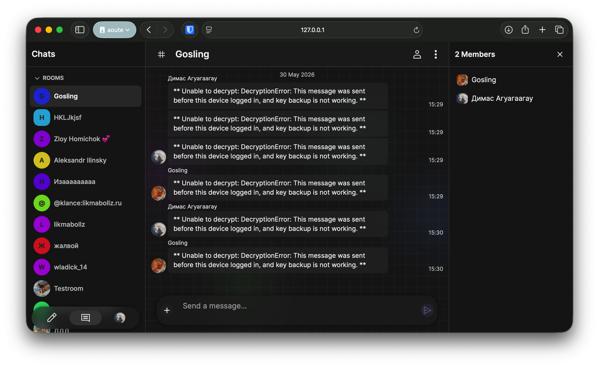
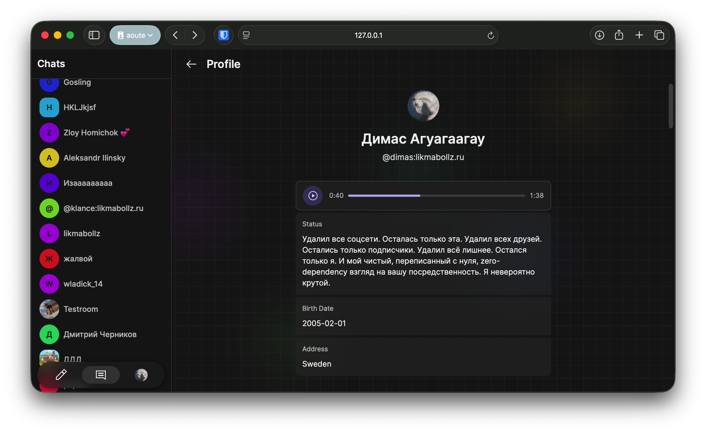
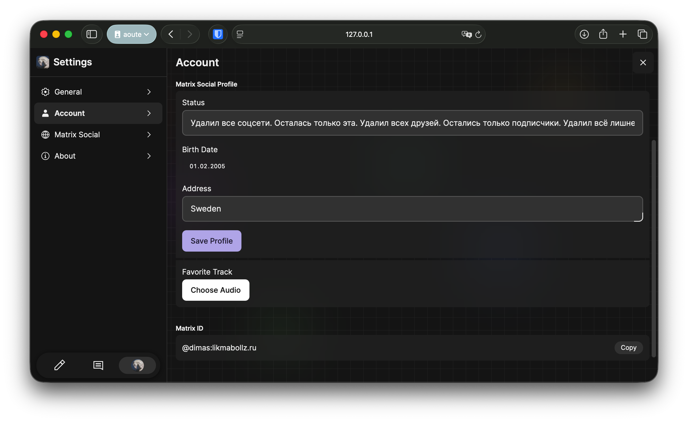
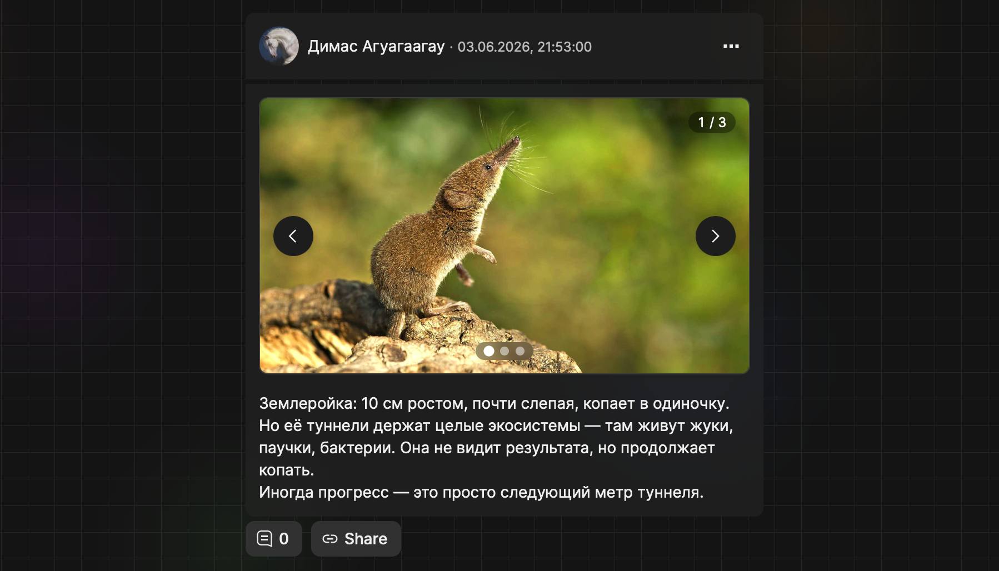
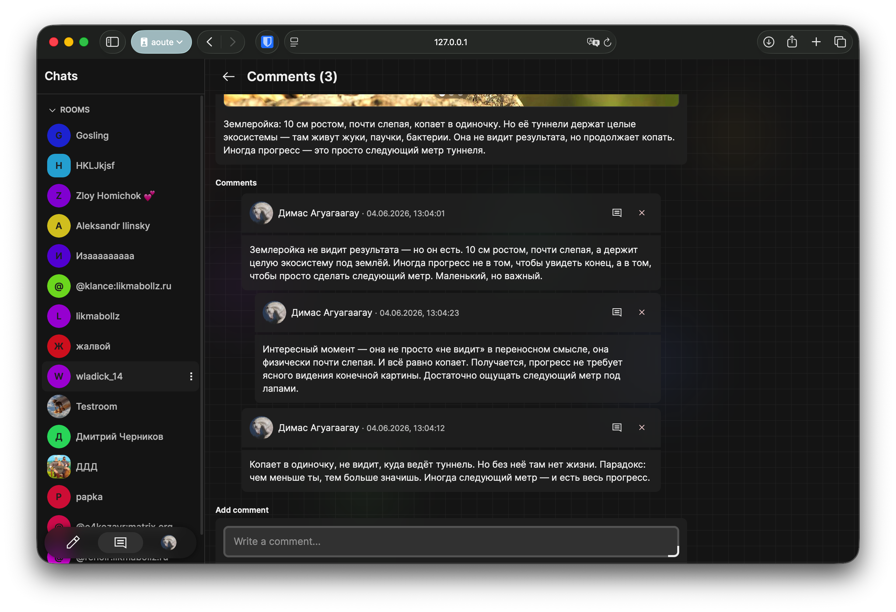
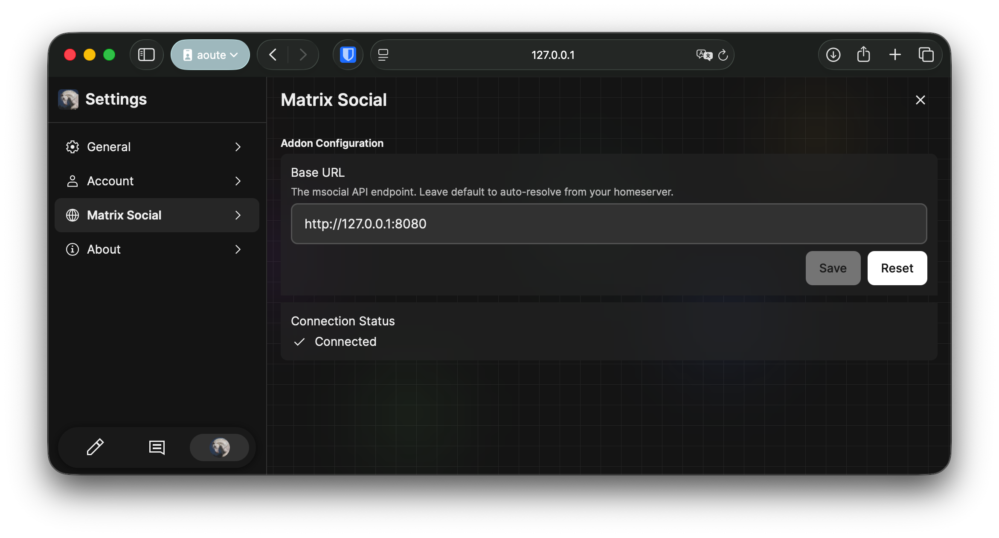

# Пользовательский интерфейс

## 1. Общее описание

Клиентское приложение **likma** — это лёгкий Matrix-клиент с интегрированными социальными функциями msocial. Построено на **React 18** с использованием **Vite**, **TypeScript** и дизайн-системы **folds**.

Приложение интегрируется с бэкендом `msocial` через сгенерированный TypeScript SDK `msocial-js-sdk`, а для чатов использует `matrix-js-sdk`.

### 1.1. Технологический стек

| Зависимость | Версия | Назначение |
|-------------|--------|------------|
| `react` | 18.2.0 | UI-фреймворк |
| `react-router-dom` | 6.30.3 | Клиентская маршрутизация |
| `axios` | 1.16.1 | HTTP-клиент |
| `@tanstack/react-query` | 5.24.1 | Управление серверным состоянием |
| `jotai` | 2.6.0 | Атомарное глобальное состояние |
| `folds` | 2.6.2 | Дизайн-система компонентов |
| `@vanilla-extract/css` | 1.9.3 | CSS-in-JS со статической генерацией |
| `msocial-js-sdk` | 1.1.0 | Сгенерированный клиент к msocial API |
| `matrix-js-sdk` | 38.2.0 | Клиент протокола Matrix |

### 1.2. Структура проекта

```
src/
├── app/
│   ├── components/           # Переиспользуемые UI-компоненты
│   │   ├── post-card/        # Карточка поста, лента
│   │   ├── media-slider/     # Слайдер медиа
│   │   ├── page/             # Layout страниц
│   │   └── ...
│   ├── features/             # Фичи
│   │   ├── room/             # Комната чата
│   │   └── settings/         # Настройки (General, Account, Msocial, About)
│   ├── hooks/                # Кастомные React-хуки
│   │   ├── useMsocialClient.ts   # Инициализация msocial SDK
│   │   └── useMatrixClient.ts    # Matrix SDK клиент
│   ├── pages/                # Страницы приложения
│   │   ├── auth/             # Авторизация
│   │   ├── client/           # Основной клиент
│   │   │   ├── social/       # SocialPage, PostCommentsPage
│   │   │   ├── user-profile/ # UserProfilePage
│   │   │   └── settings/     # SettingsPage
│   │   └── Router.tsx        # Маршрутизация
│   ├── state/                # Глобальное состояние (Jotai)
│   ├── styles/               # CSS-стили (vanilla-extract)
│   └── utils/                # Утилиты
├── client/
│   └── initMatrix.ts         # Инициализация Matrix клиента
└── index.tsx                 # Точка входа
```

---

## 2. API-клиент (Axios + msocial-js-sdk)

Для взаимодействия с бэкендом используется сгенерированный SDK `msocial-js-sdk`, который оборачивает Axios-инстанс с автоматической авторизацией и обновлением токенов.

### 2.1. Перехватчики (interceptors)

**Request interceptor** автоматически подставляет `Authorization: Bearer <token>`.

**Response interceptor** обрабатывает 401, обновляет access-токен через refresh и повторяет запрос:

```typescript
axiosInstance.interceptors.response.use(
  (response) => response,
  async (error: AxiosError) => {
    // Обработка 401: обновление токена через refresh
    // Параллельные запросы встают в очередь и выполняются после обновления
  }
);
```

### 2.2. Инициализация

Хук `useMsocialClient` выполняет аутентификацию через Matrix OpenID при готовности Matrix-клиента:

```typescript
const openIdToken = await mx.getOpenIdToken();
const authRes = await client.auth.login({
  openidToken: openIdToken.access_token,
  userId: mx.getUserId()!,
});
client.setAuth(authRes.data);
```

---

## 3. Компоненты и страницы

### 3.1. SocialPage — лента постов и редактор

Главная страница социальной ленты. Отображает редактор нового поста и список публикаций.

### 3.2. PostCommentsPage — просмотр поста и комментариев

Загружает пост и дерево комментариев, поддерживает создание ответов и удаление собственных комментариев.

### 3.3. UserProfilePage — профиль пользователя

Отображает профиль пользователя с аватаром, персональными данными (дата рождения, адрес, статус), любимым треком и лентой постов.

### 3.4. SettingsPage и Msocial-конфигурация

Настройки разделены на категории: General, Account, Matrix Social, About. Раздел Matrix Social позволяет задать кастомный base URL API и отображает статус подключения.

### 3.5. Комната чата (Room)

Стандартный интерфейс комнаты Matrix с панелью навигации, областью сообщений и полем ввода.

---

## 4. Маршрутизация

Маршрутизация реализована на `react-router-dom` v6 с поддержкой Browser Router и Hash Router.

| Путь | Компонент | Назначение |
|------|-----------|------------|
| `/login/:server?/` | Login | Авторизация |
| `/home/` | RoomsPage | Список чатов |
| `/home/social/` | SocialPage | Лента публикаций |
| `/home/social/posts/:postId/comments/` | PostCommentsPage | Комментарии к посту |
| `/home/users/:userId/` | UserProfilePage | Профиль пользователя |
| `/home/:roomIdOrAlias/` | Room | Комната чата |
| `/settings/` | SettingsPage | Настройки |

---

## 5. Стилизация

Стилизация реализована с помощью библиотеки `@vanilla-extract/css`, которая генерирует CSS-классы на этапе сборки (zero-runtime CSS-in-JS). Глобальная тема управляется через CSS-переменные (`folds` design system), адаптирующиеся под тёмную и светлую темы.

---

## 6. Скриншоты работы приложения

### 6.1. Главный экран чата



*Рисунок 1 — Интерфейс комнаты чата*

Интерфейс комнаты чата с панелью навигации слева, областью сообщений и полем ввода.

---

### 6.2. Профиль пользователя



*Рисунок 2 — Профиль пользователя с аватаром, статусом и любимым треком*

Страница профиля пользователя: аватар, отображаемое имя, Matrix ID, персональные данные (дата рождения, адрес, статус) и встроенный аудиоплеер трека.

---

### 6.3. Редактор профиля



*Рисунок 3 — Редактор профиля с полями персональной информации*

Редактор профиля с полями для изменения статуса, даты рождения, адреса и загрузки любимого трека.

---

### 6.4. Пост с медиа



*Рисунок 4 — Публикация с изображением в ленте*

Карточка публикации с изображением, текстом, автором, датой и кнопками действий (комментарии, поделиться).

---

### 6.5. Комментарии к посту



*Рисунок 5 — Страница комментариев с древовидной структурой*

Страница комментариев: превью поста, древовидная структура ответов, аватары авторов, кнопки «Ответить» и «Удалить» для собственных комментариев.

---

### 6.6. Настройки Matrix Social



*Рисунок 6 — Настройки подключения к msocial API*

Раздел настроек Matrix Social: конфигурация base URL, статус подключения (Connected) и кнопки управления.

---

## 7. Интеграция с архитектурой PCMEF

Реализованный frontend полностью соответствует архитектуре PCMEF:

| Слой PCMEF | Реализация во frontend |
|-----------|----------------------|
| **Presentation** | React-компоненты, DTO, CSS-стили (`vanilla-extract`) |
| **Control** | API-клиент (`msocial-js-sdk`), хуки (`useMsocialClient`), маршрутизатор (`react-router`) |
| **Mediator** | Бизнес-логика в хуках и компонентах (валидация форм, управление состоянием) |
| **Entity** | TypeScript-типы (`PostDTO`, `UserDTO`, `CommentDTO`) |
| **Foundation** | Axios + REST API бэкенда msocial |

Слой **Presentation** (React) взаимодействует со слоем **Control** (API-клиент, hooks), который обращается к backend-слоям Control → Mediator → Entity → Foundation через HTTP REST.
